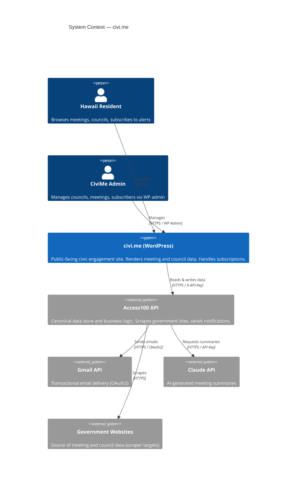

# civi.me

[](LICENSE)
[](civic.json)
[](https://wordpress.org)
[](https://php.net)
[](CONTRIBUTING.md)

---

## What is civi.me?

Hawaii has over 300 government boards, commissions, and councils that hold public meetings — and most residents have no practical way to follow them. Meeting notices are buried in government websites, scattered across dozens of domains, and formatted inconsistently. Knowing which council is relevant to your neighborhood, your school, your watershed, or your policy interests requires background knowledge that most people don't have.

civi.me makes Hawaii's government information **functionally accessible**: not just technically public, but actually usable by residents who want to participate.

The platform does this by:

- **Tracking 60+ Hawaii government councils** automatically, with meeting calendars and agenda links in one place
- **Scraping meeting agendas and documents** from government websites so residents don't have to hunt for them
- **Sending email notification digests** (daily or weekly) for the councils a subscriber follows
- **Enabling topic-based subscriptions** — residents say "I care about water policy" and receive relevant meetings across all councils, without needing to know which specific boards to follow
- **Providing council profiles** with current members, open vacancies, and areas of authority
- **Generating AI-powered meeting summaries** so residents can quickly scan what happened without reading full agenda packets
- **Supporting Hawaii's 15 Official Languages Act languages**, making the platform accessible to the state's diverse communities
- **Meeting WCAG 2.1 AA accessibility standards** (A+ rated) so all residents can use it

civi.me is open source from day one. The goal is civic infrastructure — built in public, maintained by the community, useful to anyone who wants Hawaii's government to be genuinely accessible.

---

## Key Features

- Meeting tracking across 60+ Hawaii government councils
- Automatic scraping of meeting agendas and documents from government sites
- Email notification subscriptions (daily and weekly digest options)
- Topic-based subscriptions via "What Matters to Me" — subscribe to policy areas, not individual councils
- Council profiles with members, open vacancies, and areas of authority
- AI-generated meeting summaries via Claude API
- Multilingual support for Hawaii's 15 Official Languages Act languages
- WCAG 2.1 AA accessibility (A+ rated)
- Token-based subscription management (no WordPress account required)
- Honeypot anti-spam (no CAPTCHA — privacy-preserving)
- Admin dashboard for councils, meetings, reminders, and subscriber management

---

## Architecture

civi.me is a **two-system architecture**. WordPress is the public-facing frontend — it renders data and handles form submissions. Access100 API is the canonical data store and business logic backend — it scrapes government sites, stores all records, and sends notifications.

These two systems have a hard boundary. **WordPress never holds canonical data.** Every meeting record, council profile, subscriber preference, and notification history lives in Access100 API. WordPress fetches everything server-to-server using an `X-API-Key` header. No API key or direct API call ever reaches the browser.



The boundary rule: WordPress writes to the API only for subscriptions, reminders, and admin operations authenticated by a WP admin session. It never writes meeting or council data.

For full architecture details, see [Architecture Overview](docs/architecture/OVERVIEW.md).

---

## Project Structure

This repository contains the WordPress side of the two-system architecture.

```
wp-content/
  themes/civime/              # Custom theme
  plugins/
    civime-core/              # API client, admin dashboard, caching
    civime-meetings/          # Meeting list, detail, council pages
    civime-notifications/     # Subscribe, manage, unsubscribe flows
    civime-guides/            # Civic engagement guides
    civime-i18n/              # Multilingual support (15 languages)
    civime-events/            # Community events
    civime-topics/            # Topic-based subscription picker
```

### Plugin Status

| Plugin | Status | Description |
|--------|--------|-------------|
| civime-core | Complete | API client (~30 methods), settings, 5 admin controllers (Sync, Meetings, Reminders, Councils, Subscribers), transient caching, civime_api() singleton |
| civime-meetings | Complete | Meeting list, detail, and council profile pages; router (3 routes); data mapper |
| civime-notifications | Complete | Subscribe, manage, unsubscribe, and notify flows; router (4 routes); honeypot anti-spam |
| civime-guides | Active | Civic guides custom post type with archive and single templates; seeder for initial content |
| civime-i18n | Active | Multilingual support for Hawaii's 15 OLA languages — locale switching, language picker, hreflang SEO tags |
| civime-events | Active | Community events (letter writing parties, info sessions, ambassador meetups) — CPT with archive and single |
| civime-topics | Active | "What Matters to Me" topic picker — lets users select policy topics instead of browsing 300+ councils |
| civime (theme) | Complete | Lexend + Source Sans 3, CSS custom properties, light/dark mode, mobile-first, WCAG 2.1 AA |

---

## Tech Stack

| Component | Technology |
|-----------|-----------|
| Frontend | WordPress (PHP 8.2+) |
| Theme | Custom (Lexend + Source Sans 3, CSS custom properties, light/dark mode) |
| API Backend | Access100 (Node.js, PostgreSQL) |
| Email | Gmail API (OAuth2 refresh token) |
| AI | Claude API (meeting summaries) |
| Infrastructure | Docker (wordpress:latest + mariadb:10.11) |
| Proxy / SSL | Nginx Proxy Manager |

---

## Getting Started

### Prerequisites

- Docker and Docker Compose
- Git

### Setup

1. Clone the repository:

   ```bash
   git clone https://github.com/civime/civi.me.git
   cd civi.me
   ```

2. Follow the [Infrastructure Setup Guide](docs/infrastructure/INFRASTRUCTURE.md) for complete Docker configuration, environment variable setup, and troubleshooting.

3. Configure the API connection in WP Admin > Settings > CiviMe:
   - **API URL:** your Access100 API base URL (e.g., `https://access100.app`)
   - **API Key:** your dev API key from the Access100 configuration

4. Read the [Architecture Overview](docs/architecture/OVERVIEW.md) to understand the two-system boundary before making changes.

For full setup details — including Docker Compose configuration, bind mount layout, and environment variables — see [INFRASTRUCTURE.md](docs/infrastructure/INFRASTRUCTURE.md).

---

## Documentation

All documentation is in the `docs/` directory, organized by topic.

### Architecture

- [Architecture Overview](docs/architecture/OVERVIEW.md) — Two-system boundary, what each system owns, design principles
- [URL Routing](docs/architecture/ROUTING.md) — Every URL mapped to the plugin that owns it, with routing priorities
- [Data Flow](docs/architecture/DATA-FLOW.md) — Mermaid sequence diagrams for page load, subscription, and admin flows
- [Caching](docs/architecture/CACHING.md) — Public caching behavior, TTLs, bypass rules, and clearing

### API

- [API Endpoints](docs/api/ENDPOINTS.md) — All 52 Access100 API routes grouped by domain (meetings, councils, subscriptions, admin)
- [Subscription Lifecycle](docs/api/SUBSCRIPTION-LIFECYCLE.md) — Token-based subscription flow: subscribe → confirm → manage → unsubscribe
- [OpenAPI Spec](docs/api/openapi.yaml) — Machine-readable OpenAPI 3.1 specification
- [API Reference](docs/api/redoc.html) — Pre-rendered Redoc HTML reference

### Data Model

- [Database Schema](docs/data-model/SCHEMA.md) — All 18 tables with ER diagrams (core domain + support/operations)

### Plugins and Theme

- [Plugin Reference](docs/plugins/PLUGINS.md) — All 7 plugins and the theme: architecture, routing, patterns, CSS/JS conventions

### Infrastructure

- [Infrastructure Setup](docs/infrastructure/INFRASTRUCTURE.md) — Docker setup, environment variables, networking, troubleshooting

### Architecture Decision Records

- [ADR-001: Plugin-per-Feature Architecture](docs/decisions/ADR-001-plugin-per-feature.md) — Why each feature is a separate plugin
- [ADR-002: Token-Based Subscription Auth](docs/decisions/ADR-002-token-based-auth.md) — Why subscribers don't need WordPress accounts

---

## How It Works

A resident visiting civi.me sees a feed of upcoming meetings across all tracked councils. They can:

1. **Browse by council** — view a council's profile, current members, vacancies, and past/upcoming meetings
2. **Search and filter** — find meetings by keyword, council, or date range
3. **Subscribe to alerts** — enter an email and select councils or topics to receive digest emails
4. **Manage their subscription** — use a secure link (no password required) to change preferences or unsubscribe

Behind the scenes:

- The **Access100 API scraper** runs hourly, checking government websites for new meeting notices and agendas
- When new content is found, it is stored in PostgreSQL and topic-classified
- At scheduled intervals (daily or weekly per subscriber preference), the API sends digest emails via Gmail API
- WordPress fetches data server-to-server on each page load, with 15-minute transient caching to keep response times fast

The two-system architecture means the WordPress codebase is purely a rendering and forms layer. Adding a new council to the tracker, correcting a meeting record, or adjusting notification logic all happen on the Access100 side.

---

## Contributing

We welcome contributions! civi.me is civic infrastructure — every improvement makes Hawaii's government more accessible to more people.

See [CONTRIBUTING.md](CONTRIBUTING.md) for the full development workflow, coding standards, and how to submit a pull request.

### Key conventions at a glance

- **PHP:** `CiviMe_{Plugin}_` class prefix (e.g., `CiviMe_Meetings_Router`), SPL autoloader, union types, Router → Controller → Template pattern
- **CSS:** BEM naming (`.block__element--modifier`), theme CSS custom properties (never hardcode colors), 44px WCAG touch targets
- **JS:** Vanilla JS only, IIFE scope, progressive enhancement — everything works without JS
- **API calls:** All API access goes through `civime_api()` — never make direct HTTP requests from plugin code

Full coding standards and patterns: [CONTRIBUTING.md](CONTRIBUTING.md) and [Plugin Reference](docs/plugins/PLUGINS.md).

---

## Architecture Decisions

Key decisions that shaped this codebase:

- **Plugin-per-feature** — Each feature (meetings, notifications, guides, topics, events) is a separate plugin. Only shared utilities live in civime-core. This gives loose coupling, independent activation, and a clean dependency direction. ([ADR-001](docs/decisions/ADR-001-plugin-per-feature.md))

- **Server-side-only API calls** — WordPress calls Access100 API server-to-server. Browsers talk to WordPress; WordPress talks to the API. No API key or direct API call ever reaches the browser.

- **Token-based subscription auth** — Subscribers use opaque tokens (confirm_token + manage_token) to verify and manage their alerts. No WordPress account required. Email address is the only identity. ([ADR-002](docs/decisions/ADR-002-token-based-auth.md))

- **No CAPTCHA** — A honeypot field (hidden from humans, filled by bots) catches automated submissions without friction for real users or fingerprinting concerns.

- **Transient caching** — API responses are cached via WordPress transients with configurable TTLs. Public pages use 15-minute caches by default; admin pages bypass the cache.

- **POST-redirect-GET for all forms** — No double-submit on refresh; clean browser history for form flows.

---

## License

This project is licensed under the GPL v2 — see the [LICENSE](LICENSE) file for details.

---

## Acknowledgments

- [Code for Hawaii](https://www.codeforhawaii.org/) and the civic tech community for inspiration and support
- Hawaii state and county government agencies for making meeting data publicly available
- The open source community — this project builds on WordPress, Docker, and dozens of open source dependencies
