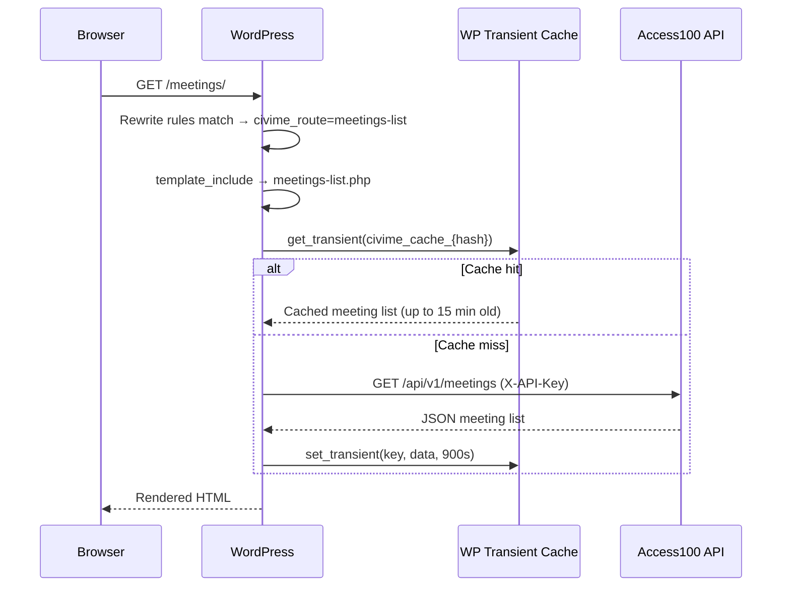
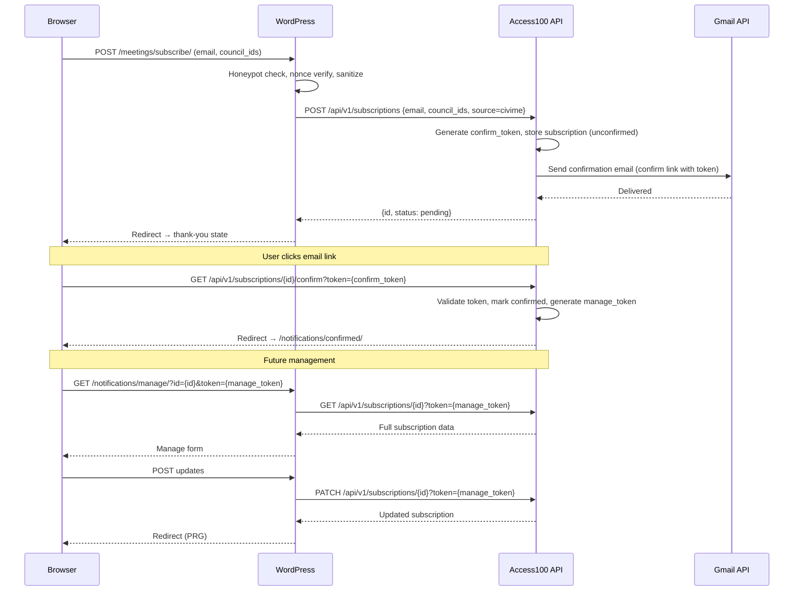
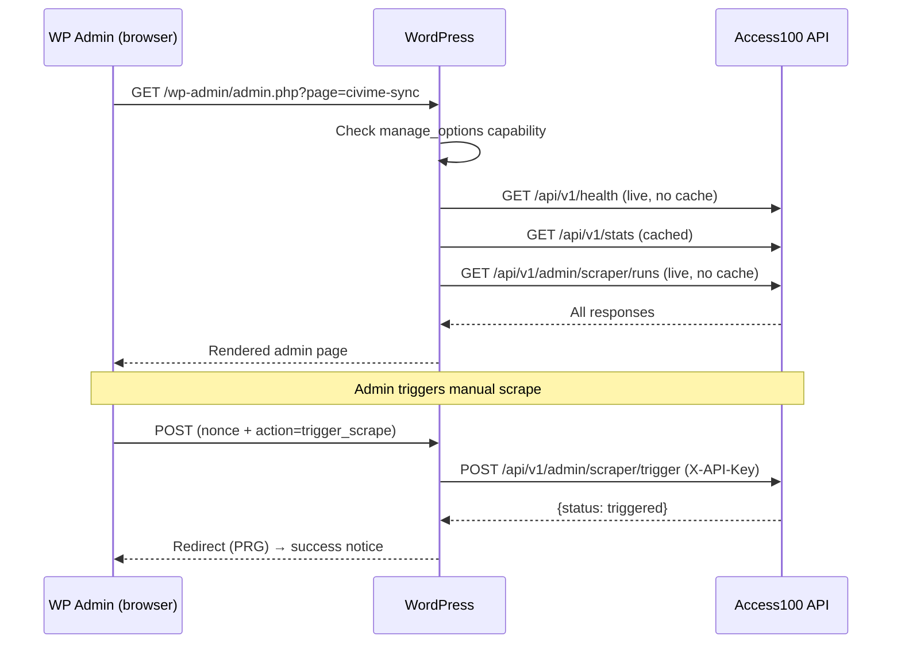

# Data Flow

This document shows how data moves through the civi.me system at runtime. Three flows are covered: a public page load, the subscription lifecycle, and admin operations. Each is a separate sequence diagram.

---

## Public Page Load

When a visitor requests a public page, WordPress checks its transient cache before calling the Access100 API. Cache hits return immediately; misses fetch from the API and populate the cache for subsequent requests.

---

## Subscription Lifecycle

The subscription flow spans both systems and involves email. WordPress handles the form submission and sanitization; the Access100 API owns the subscription state and sends the confirmation email via Gmail API. The confirm and manage steps happen via token-authenticated API calls.

---

## Admin Operations

Admin pages in WordPress make live (uncached) API calls to ensure current data. Write operations (like triggering a scrape) use POST-redirect-GET to prevent duplicate submissions.

---

## See Also

- [OVERVIEW.md](OVERVIEW.md) — System context and component map
- [CACHING.md](CACHING.md) — Cache behavior: what gets cached, TTL, and how to clear
