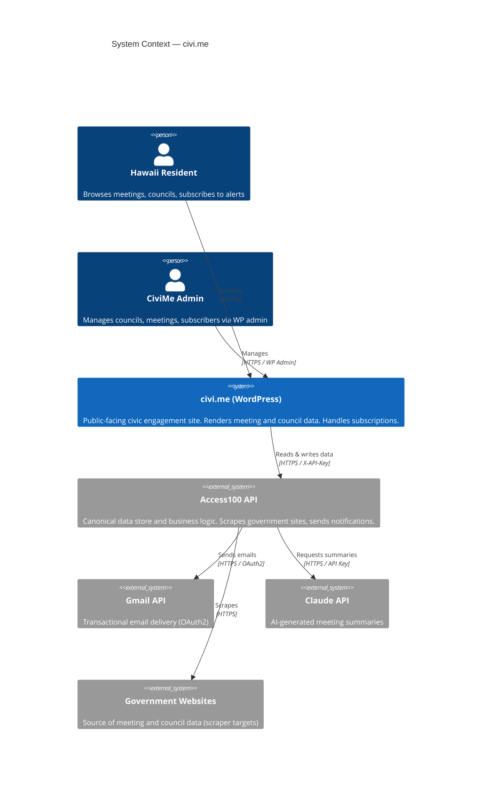

# civi.me Architecture Overview

civi.me is a two-system civic engagement platform for Hawaii. WordPress is the public-facing frontend — it renders data and handles form submissions. Access100 API is the canonical data store and business logic backend — it scrapes government sites, stores records, and sends notifications.

These two systems have a hard boundary. Understanding that boundary is the first thing to know about this codebase.

---

## System Responsibilities

### WordPress holds

- Theme and plugin code (`wp-content/themes/civime/`, `wp-content/plugins/civime-*/`)
- Static page content (`wp-content/page-content/`)
- Civic guides (custom post type `civime_guide`, stored in WP database)
- Events (custom post type `civime_event`, stored in WP database)
- WordPress admin users (`manage_options` capability only — no public accounts)
- Settings: API URL and API key (stored in `wp_options`)

### Access100 API holds (canonical)

WordPress never duplicates or writes these records:

- All meeting records
- All council records (profile, members, vacancies, authorities)
- All subscriber records and notification preferences
- All reminder records
- Topic classifications
- AI-generated meeting summaries
- Scraper run history

---

## The Boundary Rule

> **WordPress never writes meeting or council data.**
>
> All writes from WordPress to the API are limited to:
> - Subscription creation
> - Reminder creation
> - Subscription management (via token — no WP login required)
> - Admin operations authenticated by the WP admin session

If a future change would have WordPress storing or updating meeting or council records locally, it violates this boundary.

---

## System Communication

Every server-to-server call from WordPress to the API:

- Sends an `X-API-Key` header (stored in `wp_options` — never exposed to browsers)
- Sets `User-Agent: CiviMe-WordPress/{version}`
- Targets `https://access100.app` (configurable in WP Settings > CiviMe)

All API communication is server-side only. No API key or direct API call ever reaches the browser.

---

## Design Principles

- **Server-side-only API calls** — browsers talk to WordPress; WordPress talks to Access100 API
- **No canonical data in WordPress** — WordPress is a rendering and forms layer, not a data owner
- **Plugin-per-feature architecture** — each feature (meetings, notifications, guides, topics, events) is its own plugin; only shared utilities live in civime-core
- **POST-redirect-GET for all forms** — no double-submit on refresh
- **Honeypot anti-spam** — no CAPTCHA; a hidden field catches bots without friction for real users
- **Token-based subscription auth** — subscribers use opaque tokens (not WP accounts) to manage their alerts

---

## System Context

Two system actors (resident, admin) interact with civi.me WordPress, which communicates server-to-server with Access100 API. The API consumes three external services.

---

## See Also

- [ROUTING.md](./ROUTING.md) — Every URL mapped to the plugin that owns it, with routing mechanism and priority system
- [DATA-FLOW.md](./DATA-FLOW.md) — Sequence diagrams for page load, subscription lifecycle, and admin operations
- [CACHING.md](./CACHING.md) — Public caching (15 min default), admin bypass, and cache clearing
