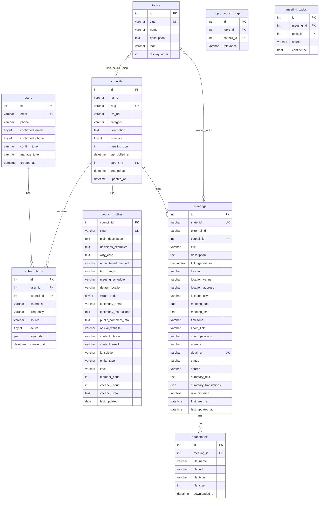
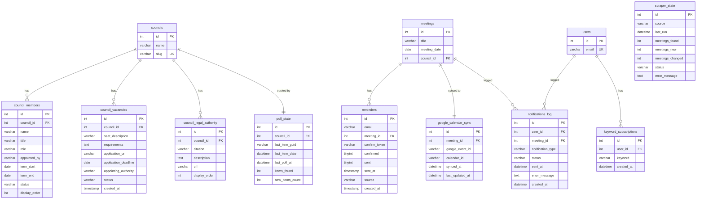

# Access100 — Database Schema

This document describes all 18 tables in the Access100 MySQL database (live schema as of 2026-03-16, queried directly from `appwebsite-db-1`). The schema is the authoritative record — use this document rather than the migration files, which diverge from the live database in several places (see [Schema Notes](#schema-notes)).

---

## ER Diagrams

### Core Domain

### Support and Operations

---

## Table Reference

### Core Identity Tables

#### users

Stores subscriber identity, contact info, and authentication tokens. One row per unique email address — all subscriptions across councils share a single user record.

| Column | Type | Notes |
|--------|------|-------|
| id | int PK AUTO_INCREMENT | |
| email | varchar(255) UNIQUE NOT NULL | |
| phone | varchar(20) | Optional, E.164 format |
| confirmed_email | tinyint(1) DEFAULT 0 | Set to 1 on confirm link click |
| confirmed_phone | tinyint(1) DEFAULT 0 | Set to 1 on SMS YES reply |
| confirm_token | varchar(64) | Not cleared after use — confirmed_email=1 is authoritative |
| manage_token | varchar(64) | Permanent until regenerated |
| created_at | datetime DEFAULT CURRENT_TIMESTAMP | |
| updated_at | datetime ON UPDATE CURRENT_TIMESTAMP | |
| name | varchar(255) | Legacy — not used by current API |
| is_verified | tinyint(1) DEFAULT 0 | Legacy — superseded by confirmed_email |
| verification_token | varchar(64) | Legacy — superseded by confirm_token |
| notification_email | tinyint(1) DEFAULT 1 | Legacy — superseded by subscriptions.channels |
| notification_sms | tinyint(1) DEFAULT 0 | Legacy — superseded by subscriptions.channels |
| notification_frequency | enum('instant','daily','weekly') | Legacy — superseded by subscriptions.frequency |

**Legacy columns note:** The seven legacy columns (`name`, `is_verified`, `verification_token`, `notification_email`, `notification_sms`, `notification_frequency`, `updated_at`) exist from a pre-migration era when user preferences were stored directly on the user record. The current API stores all notification preferences in the `subscriptions` table and does not read or write these legacy columns. They are excluded from the ER diagram above to reduce noise.

#### subscriptions

Per-council notification subscription record. One row per user/council pair. A user with subscriptions to three councils will have three rows in this table.

| Column | Type | Notes |
|--------|------|-------|
| id | int PK AUTO_INCREMENT | |
| user_id | int FK → users.id ON DELETE CASCADE | |
| council_id | int FK → councils.id ON DELETE CASCADE | |
| channels | varchar(20) DEFAULT 'email' | 'email', 'sms', or 'email,sms' |
| frequency | varchar(20) DEFAULT 'immediate' | 'immediate', 'daily', 'weekly' |
| source | varchar(50) DEFAULT 'access100' | Identifies originating app |
| active | tinyint(1) DEFAULT 1 | Soft-delete flag |
| topic_ids | json DEFAULT NULL | Topic filter (if subscribed via topic) |
| created_at | datetime DEFAULT CURRENT_TIMESTAMP | |
| UNIQUE | (user_id, council_id) | One subscription per user/council pair |

---

### Council Tables

#### councils

Government bodies tracked by the system. Each council has an RSS feed URL that the scraper polls for new meeting announcements.

| Column | Type | Notes |
|--------|------|-------|
| id | int PK AUTO_INCREMENT | |
| name | varchar(255) NOT NULL | |
| slug | varchar(255) UNIQUE NOT NULL | |
| rss_url | varchar(500) NOT NULL | Source RSS feed URL |
| category | varchar(100) | |
| description | text | |
| is_active | tinyint(1) DEFAULT 1 | |
| meeting_count | int DEFAULT 0 | Denormalized count |
| last_polled_at | datetime | |
| parent_id | int FK → councils.id ON DELETE SET NULL | For sub-committees |
| created_at | datetime | |
| updated_at | datetime | |

#### council_profiles

Enriched human-readable content for each council — engagement copy, participation info, contact details, and jurisdiction metadata. One row per council (1:1 with councils).

| Column | Type | Notes |
|--------|------|-------|
| council_id | int PK FK → councils.id | 1:1 with councils |
| slug | varchar(100) UNIQUE | URL slug for profile pages |
| plain_description | text | Engagement copy |
| decisions_examples | text | Examples of past decisions |
| why_care | text | Civic engagement copy |
| appointment_method | varchar | How members are appointed |
| term_length | varchar | Length of member terms |
| meeting_schedule | varchar | How often the council meets |
| default_location | varchar(500) | |
| virtual_option | tinyint(1) DEFAULT 0 | |
| testimony_email | varchar | Email for public testimony |
| testimony_instructions | text | How to submit testimony |
| public_comment_info | text | Public comment participation info |
| official_website | varchar | |
| contact_phone | varchar | |
| contact_email | varchar | |
| jurisdiction | enum('state','honolulu','maui','hawaii','kauai') | |
| entity_type | enum('board','commission','council','committee','authority','department','office','task_force','neighborhood_board') | Extended in migration 006 |
| level | enum('state','county','neighborhood') DEFAULT 'state' | Added in migration 006 |
| member_count | int | Denormalized count |
| vacancy_count | int | Denormalized count |
| vacancy_info | text | |
| last_updated | date | |

#### council_members

Board and commission member roster. Multiple rows per council.

| Column | Type | Notes |
|--------|------|-------|
| id | int PK AUTO_INCREMENT | |
| council_id | int FK → councils.id | |
| name | varchar(200) NOT NULL | |
| title | varchar(200) | |
| role | enum('chair','vice-chair','member','ex-officio') DEFAULT 'member' | |
| appointed_by | varchar(200) | |
| term_start | date | |
| term_end | date | |
| status | enum('active','expired','vacant') DEFAULT 'active' | |
| display_order | int DEFAULT 0 | |

#### council_vacancies

Open appointment seats for boards and commissions. Multiple rows per council, tracked with status transitions.

| Column | Type | Notes |
|--------|------|-------|
| id | int PK AUTO_INCREMENT | |
| council_id | int FK → councils.id | |
| seat_description | varchar(200) | |
| requirements | text | |
| application_url | varchar(500) | |
| application_deadline | date | |
| appointing_authority | varchar(200) | |
| status | enum('open','filled','closed') DEFAULT 'open' | |
| created_at | timestamp | |

#### council_legal_authority

Statutory references (Hawaii Revised Statutes chapters, etc.) that establish each council's legal authority. Multiple rows per council.

| Column | Type | Notes |
|--------|------|-------|
| id | int PK AUTO_INCREMENT | |
| council_id | int FK → councils.id | |
| citation | varchar(200) NOT NULL | e.g., "HRS Chapter 302A" |
| description | text | |
| url | varchar(500) | |
| display_order | int DEFAULT 0 | |

---

### Meeting Tables

#### meetings

Government meeting records scraped from RSS feeds. Central table — most other tables reference meetings directly.

| Column | Type | Notes |
|--------|------|-------|
| id | int PK AUTO_INCREMENT | |
| state_id | varchar(50) UNIQUE | Synthetic or eHawaii state ID (was INT, changed in migration 005) |
| external_id | varchar(255) NOT NULL | Source system identifier |
| council_id | int FK → councils.id ON DELETE CASCADE | |
| title | varchar(500) NOT NULL | |
| description | text | HTML-stripped agenda |
| full_agenda_text | mediumtext | Full scraped agenda |
| location | varchar(500) | |
| location_venue | varchar | Parsed location sub-fields |
| location_address | varchar | Parsed location sub-fields |
| location_city | varchar | Parsed location sub-fields |
| meeting_date | date NOT NULL | |
| meeting_time | time | |
| timezone | varchar(50) DEFAULT 'Pacific/Honolulu' | |
| zoom_link | varchar(500) | |
| zoom_password | varchar(255) | |
| agenda_url | varchar(500) | Link to separate agenda document |
| detail_url | varchar(500) UNIQUE | Source page URL |
| status | enum('active','cancelled','updated') DEFAULT 'active' | Note: 'active' not 'scheduled' — see Schema Notes |
| source | enum('ehawaii','nco','honolulu_boards','maui_legistar') DEFAULT 'ehawaii' | |
| summary_text | text | AI-generated HTML summary |
| summary_translations | json | Reserved for i18n |
| raw_rss_data | longtext | Raw RSS payload (JSON) |
| first_seen_at | datetime DEFAULT CURRENT_TIMESTAMP | |
| last_updated_at | datetime ON UPDATE CURRENT_TIMESTAMP | |

#### attachments

Meeting document attachments (agendas, minutes, supporting documents). Multiple rows per meeting.

| Column | Type | Notes |
|--------|------|-------|
| id | int PK AUTO_INCREMENT | |
| meeting_id | int FK → meetings.id ON DELETE CASCADE | |
| file_name | varchar(255) NOT NULL | |
| file_url | varchar(1024) NOT NULL | |
| file_type | varchar(50) | e.g., 'pdf' |
| file_size | int | Bytes |
| downloaded_at | datetime | |
| UNIQUE | (meeting_id, file_url(255)) | |

---

### Topic Tables

#### topics

The 16 civic topic categories used to classify meetings and councils. Seeded at initialization — not created by user action.

| Column | Type | Notes |
|--------|------|-------|
| id | int PK AUTO_INCREMENT | |
| slug | varchar(50) UNIQUE NOT NULL | URL-safe slug |
| name | varchar(100) NOT NULL | Display name |
| description | text | |
| icon | varchar(10) | Emoji |
| display_order | int DEFAULT 0 | |

#### topic_council_map

Many-to-many join table between topics and councils. Establishes which civic topics a council addresses (e.g., "Education" → "Board of Education").

| Column | Type | Notes |
|--------|------|-------|
| id | int PK AUTO_INCREMENT | |
| topic_id | int FK → topics.id | |
| council_id | int FK → councils.id | |
| relevance | enum('primary','secondary') DEFAULT 'primary' | |
| UNIQUE | (topic_id, council_id) | |

#### meeting_topics

AI-classified topic tags for individual meetings. Each meeting can be tagged with multiple topics; `source` indicates whether tagging was manual or AI-generated.

| Column | Type | Notes |
|--------|------|-------|
| id | int PK AUTO_INCREMENT | |
| meeting_id | int FK → meetings.id | |
| topic_id | int FK → topics.id | |
| source | enum('static','ai') DEFAULT 'static' | |
| confidence | float DEFAULT 1.0 | AI confidence score |
| UNIQUE | (meeting_id, topic_id) | |

---

### Notification and Reminder Tables

#### reminders

One-time day-of email reminders for specific meetings. Distinct from subscriptions — reminders do not require account creation and are tied to a single meeting.

| Column | Type | Notes |
|--------|------|-------|
| id | int PK AUTO_INCREMENT | |
| email | varchar(255) NOT NULL | |
| meeting_id | int FK → meetings.id ON DELETE CASCADE | |
| confirm_token | varchar(64) NOT NULL | Single-use confirmation token |
| confirmed | tinyint(1) DEFAULT 0 | |
| sent | tinyint(1) DEFAULT 0 | |
| sent_at | timestamp NULL | |
| source | varchar(50) DEFAULT 'access100' | |
| created_at | timestamp | |
| UNIQUE | (email, meeting_id) | One reminder per email/meeting |

#### notifications_log

Audit log of all sent notifications (email and SMS). Records delivery status and errors for debugging. Not a queue — entries are append-only records of what was sent.

| Column | Type | Notes |
|--------|------|-------|
| id | int PK AUTO_INCREMENT | |
| user_id | int FK → users.id ON DELETE CASCADE | |
| meeting_id | int FK → meetings.id ON DELETE CASCADE | |
| notification_type | enum('email','sms','telegram') NOT NULL | |
| status | enum('sent','failed','pending') DEFAULT 'pending' | |
| sent_at | datetime | |
| error_message | text | |
| created_at | datetime DEFAULT CURRENT_TIMESTAMP | |

---

### Operations Tables

#### scraper_state

Scraper run history and status per source. One row per scraper run — provides audit trail and supports the admin scraper history view.

| Column | Type | Notes |
|--------|------|-------|
| id | int PK AUTO_INCREMENT | |
| source | varchar(50) NOT NULL | 'ehawaii', 'nco', etc. |
| last_run | datetime NOT NULL | |
| meetings_found | int | Run statistics |
| meetings_new | int | Run statistics |
| meetings_changed | int | Run statistics |
| status | varchar(20) DEFAULT 'success' | |
| error_message | text | |

#### poll_state

Per-council RSS poll tracking. Stores the last seen RSS item so the scraper can detect new items incrementally. Contains 115,561 rows as of the research date. One row per council (1:1 with councils).

**Note:** This table is absent from the numbered migration files — it was created outside the migration system.

| Column | Type | Notes |
|--------|------|-------|
| id | int PK AUTO_INCREMENT | |
| council_id | int FK → councils.id ON DELETE CASCADE UNIQUE | 1:1 with councils |
| last_item_guid | varchar(500) | Last seen RSS item GUID |
| last_item_date | datetime | |
| last_poll_at | datetime | |
| items_found | int | |
| new_items_count | int | |

#### google_calendar_sync

Google Calendar event sync state per meeting. Tracks which Google Calendar event corresponds to each meeting and when it was last synced. One row per meeting (1:1 with meetings).

**Note:** This table is absent from the numbered migration files — it was created outside the migration system.

| Column | Type | Notes |
|--------|------|-------|
| id | int PK AUTO_INCREMENT | |
| meeting_id | int FK → meetings.id ON DELETE CASCADE UNIQUE | 1:1 with meetings |
| google_event_id | varchar(255) NOT NULL | |
| calendar_id | varchar(255) NOT NULL | |
| synced_at | datetime | |
| last_updated_at | datetime ON UPDATE CURRENT_TIMESTAMP | |

---

### Future / Experimental Tables

#### keyword_subscriptions

Reserved for future use. Intended for keyword-based alert subscriptions (notify when a keyword appears in a meeting agenda). No API endpoints currently read or write to this table.

**Note:** This table is absent from the numbered migration files — it was created outside the migration system.

| Column | Type | Notes |
|--------|------|-------|
| id | int PK AUTO_INCREMENT | |
| user_id | int FK → users.id ON DELETE CASCADE | |
| keyword | varchar(100) NOT NULL | |
| created_at | datetime | |
| UNIQUE | (user_id, keyword) | |

---

## Token Auth Model

Access100 uses two token types on the `users` table and one on the `reminders` table. None of these tokens use JWT or sessions — they are opaque hex strings stored in the database and validated by direct lookup.

### users.confirm_token

Sent in the opt-in confirmation email when a user subscribes. Clicking the link confirms the user's email address.

- **Format:** 64-character hex string
- **Generated:** At subscription creation time
- **Delivered:** In confirmation email as `?token=` URL parameter
- **Validated:** `GET /subscriptions/confirm` looks up the token in the indexed column (`idx_users_confirm_token`)
- **Cleared:** Not explicitly cleared after use — `users.confirmed_email = 1` is the authoritative confirmed state
- **Expiry:** None — tokens do not expire; they remain valid indefinitely

### users.manage_token

The long-lived self-service token returned when a user subscribes. Required for all subscription management operations.

- **Format:** 64-character hex string
- **Generated:** At subscription creation, returned in the `201` response body
- **Used:** As `?token=` parameter on all `GET /subscriptions/{id}`, `PATCH /subscriptions/{id}`, `PUT /subscriptions/{id}/councils`, and `DELETE /subscriptions/{id}` endpoints
- **Scope:** One token per user; covers all of that user's subscriptions across councils
- **Lifecycle:** Permanent — does not expire or rotate
- **Validation:** Timing-safe comparison against `users.manage_token`

### reminders.confirm_token

A separate confirmation token for the reminder flow. Distinct from `users.confirm_token` — different column, different table, different lifecycle.

- **Format:** 64-character hex string
- **Generated:** At `POST /reminders` time
- **Delivered:** In the reminder confirmation email
- **Used:** User clicks link to confirm the reminder — sets `reminders.confirmed = 1`
- **Lifecycle:** Tied to the reminder row; deleted when the reminder row is deleted
- **Distinction:** This is not related to `users.confirm_token` — reminders do not require a user account

For the complete subscription lifecycle showing how these tokens are used at each step, see [SUBSCRIPTION-LIFECYCLE.md](../api/SUBSCRIPTION-LIFECYCLE.md).

---

## Schema Notes

Known divergences from the numbered migration files (`001` through `007`):

**notification_queue:** Defined in migration 001 but does not exist in the live database. The implementation evolved from a queue-based design to a log-based design. The actual table is `notifications_log` with a different schema. The `notification_queue` table should be ignored when reading migration files.

**users legacy columns:** Seven legacy columns exist on the `users` table from a pre-migration era: `name`, `is_verified`, `verification_token`, `notification_email`, `notification_sms`, `notification_frequency`, `updated_at`. These columns are present in the live database but are not read or written by the current API. They are documented in the table reference above with "Legacy" notes and excluded from the ER diagrams.

**meetings.status enum:** The live database defines this column as `ENUM('active','cancelled','updated')`. Some earlier documentation showed `'scheduled'` as a valid status value — this is incorrect. The value `'active'` is the default and represents a scheduled/upcoming meeting.

**Tables absent from migrations:** Three tables were created outside the numbered migration system and do not appear in any migration file: `google_calendar_sync`, `keyword_subscriptions`, and `poll_state`. All three exist in the live database and are documented above. Do not assume a table is absent because it is missing from migrations — always use the live database as the authoritative source.
