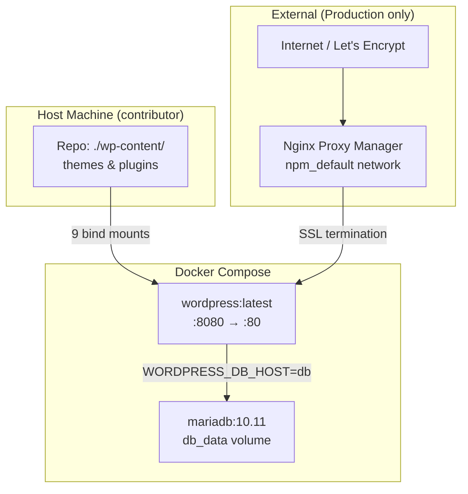

# Infrastructure Documentation

This document covers everything a contributor needs to understand and run the civi.me WordPress system locally: Docker setup, step-by-step local dev guide, environment configuration, production architecture reference, and troubleshooting. See [docs/architecture/OVERVIEW.md](../architecture/OVERVIEW.md) for the two-system architecture context — civi.me WordPress and the Access100 API are separate systems. This document covers the WordPress system infrastructure only; the Access100 API runs in a separate repository and deployment.

---

## Prerequisites

- [Docker Desktop](https://docs.docker.com/get-docker/) (includes Docker Compose v2) or Docker Engine 20.10+ with the Compose plugin
- [Git](https://git-scm.com/downloads)
- ~2 GB disk space for Docker images and the database

No OS-specific setup is required. All instructions work on any system that runs Docker.

---

## Quick Start

```bash
# 1. Clone the repository
git clone https://github.com/civime/civi.me.git && cd civi.me

# 2. Configure environment — edit the passwords before proceeding
cp .env.example .env

# 3. Start containers
docker compose up -d

# 4. Visit http://localhost:8080 — complete the WordPress installation wizard
```

See [Step-by-Step Setup](#step-by-step-setup) below for detailed instructions and troubleshooting at each step.

---

## Step-by-Step Setup

### Step 1: Clone the Repository

```bash
git clone https://github.com/civime/civi.me.git
cd civi.me
```

**Expected:** A directory containing `wp-content/`, `docker-compose.yml`, `.env.example`, `apache-wordpress.conf`, and the project source files.

**If this fails:** Verify Git is installed (`git --version`) and that you have network access to GitHub.

---

### Step 2: Configure Environment

```bash
cp .env.example .env
```

Open `.env` in a text editor and set strong passwords for `MYSQL_ROOT_PASSWORD` and `MYSQL_PASSWORD`. For local development any random string works — these passwords stay on your machine.

**If this fails:** Check that `.env.example` exists in the repo root. Verify that `.env` is listed in `.gitignore` (it should be — never commit `.env`).

---

### Step 3: Start Containers

```bash
docker compose up -d
```

**Expected output:**
```
Container civi-me-db-1 Started
Container civi-me-wordpress-1 Started
```

**If this fails:**
- Verify Docker is running: `docker info`
- Check that port 8080 is not in use: `lsof -i :8080` or `netstat -tlnp | grep 8080`
- If you see `network npm_default declared as external, but could not be found` — you are using the wrong compose file. Use the `docker-compose.yml` in the repo root, not the one from `~/docker/civime-wordpress/`.

---

### Step 4: Wait for Database Initialization

On the first start, MariaDB takes 15–30 seconds to initialize. Check readiness:

```bash
docker compose logs db 2>&1 | grep "ready for connections"
```

Wait until you see `"ready for connections"` before visiting the site.

**If no "ready" message after 60 seconds:** Run `docker compose logs db` and look for error messages. A password mismatch between `MYSQL_ROOT_PASSWORD` and `MYSQL_PASSWORD` is the most common cause.

---

### Step 5: Complete WordPress Installation

Visit [http://localhost:8080](http://localhost:8080) and complete the WordPress setup wizard:

1. Select your language
2. Enter a site title (any value — e.g. "CiviMe Dev")
3. Create an admin username, password, and email address (any values for local dev)
4. Click **Install WordPress**

**If the site shows "Error establishing a database connection":** Wait 30–60 more seconds for MariaDB to finish initializing, then refresh. See [Troubleshooting](#troubleshooting) for more.

---

### Step 6: Set Permalinks

In WP Admin, go to **Settings > Permalinks**, select **Post name** (`/%postname%/`), and click **Save Changes**.

This step is required for all custom plugin routes (`/meetings`, `/notifications`, etc.) to work.

**If pages return 404 after setting permalinks:** Verify that `apache-wordpress.conf` is in the repo root and is bind-mounted in `docker-compose.yml` (it should be at `/etc/apache2/conf-enabled/wordpress.conf`). Check `docker compose logs wordpress` for Apache config errors.

---

### Step 7: Activate Plugins

In WP Admin, go to **Plugins** and activate all civime plugins. Activate **civime-core first**, then the rest in any order.

| Plugin | Slug | Must Activate |
|--------|------|---------------|
| CiviMe Core | civime-core | Yes (first) |
| CiviMe Meetings | civime-meetings | Yes |
| CiviMe Notifications | civime-notifications | Yes |
| CiviMe Guides | civime-guides | Yes |
| CiviMe Events | civime-events | Yes |
| CiviMe Topics | civime-topics | Yes |
| CiviMe i18n | civime-i18n | Yes |

**If plugins are not showing:** Check bind mount permissions — Docker needs read access to `wp-content/` directories. Verify that the plugin directories exist on the host:

```bash
ls wp-content/plugins/
```

Files should be readable by all (644 for files, 755 for directories). On Linux, if needed: `chmod -R a+r wp-content/`

---

### Step 8: Configure API Connection (Optional)

In WP Admin, go to **Settings > CiviMe** and enter the API URL and key.

Without a key the site works — all pages render but data sections show empty/fallback content. This is fine for theme and plugin UI development.

With a valid key pointing at `https://access100.app`, pages show live meeting and council data.

See [API Key Provisioning](#api-key-provisioning) for details.

---

## API Key Provisioning

API keys are provisioned by the Access100 API administrator (the project maintainer).

**For local development, two options:**

1. **Without a key** — The site renders with empty data. All pages load, no PHP errors. Good for developing theme styles, plugin UI, or testing form flows without live data.

2. **With a key** — Contact the project maintainer to request a read-only API key. Enter it at **Settings > CiviMe > API Key**.

**Technical details:**

- The API Key field is a password input — saved keys are never displayed in the UI. After saving, the field shows a placeholder: `(key saved — enter a new value to replace)`.
- Submitting the settings form with the API Key field blank **preserves** the existing stored key. You cannot accidentally wipe a key by saving other settings.
- The API client sends the key as an `X-API-Key` header on every request. Without a key, the API returns HTTP 401/403, which surfaces as a `WP_Error` in all controllers. Pages render with empty lists or an error notice — no PHP fatals.

See [docs/architecture/DATA-FLOW.md](../architecture/DATA-FLOW.md) for how the API connection works end to end.

---

## Environment Variables Reference

| Variable | System | Purpose | Required | Default | What breaks if missing |
|----------|--------|---------|----------|---------|------------------------|
| `MYSQL_ROOT_PASSWORD` | Docker (db) | MariaDB root password | Yes | none | DB container fails to start |
| `MYSQL_PASSWORD` | Docker (db + wordpress) | Shared password for `wpuser` — used by both the `db` and `wordpress` services | Yes | none | DB container fails to start; WordPress cannot connect to the database |
| `civime_api_url` | WP Admin | Base URL of the Access100 API (no trailing slash) | No | `https://access100.app` | All API calls go to production — fine for read-only development |
| `civime_api_key` | WP Admin | Value sent as `X-API-Key` header on every API request | No | `""` (empty) | API returns 401/403; pages show empty/fallback content |
| `civime_cache_ttl` | WP Admin | Seconds to cache API responses in WP transients | No | `300` | Uses default 5-minute cache — no breakage |
| `civime_cache_enabled` | WP Admin | Toggle API response caching on/off | No | `true` | Defaults to enabled — no breakage |

**Docker env vars** (`MYSQL_ROOT_PASSWORD`, `MYSQL_PASSWORD`) are set in `.env` (copied from `.env.example`).

**WP Admin settings** (`civime_api_url`, `civime_api_key`, `civime_cache_ttl`, `civime_cache_enabled`) are entered in the WordPress dashboard at **Settings > CiviMe**. They are stored in `wp_options`, not in `.env`.

See [docs/architecture/CACHING.md](../architecture/CACHING.md) for cache TTL behavior, bypass rules, and how to clear the cache.

---

## Docker Architecture



### Services

Two containers defined in `docker-compose.yml`:

- **db** — `mariadb:10.11`. MySQL-compatible relational database. Stores the WordPress database (posts, options, users, plugin data).
- **wordpress** — `wordpress:latest`. PHP application server running on Apache. Serves the WordPress site. Uses `depends_on: db` to ensure the database container starts first.

### Volumes

- **`db_data`** — Named Docker volume. Persists the MariaDB database across container restarts. Destroying this volume (`docker compose down -v`) resets the database to empty.
- **`wp_data`** — Named Docker volume. Persists the WordPress core installation at `/var/www/html`. This lets WordPress keep its base files across restarts without re-downloading.

### Bind Mounts

11 host paths are mounted into the `wordpress` container:

| Host path | Container path | Purpose |
|-----------|---------------|---------|
| `./wp-content/themes/civime` | `/var/www/html/wp-content/themes/civime` | CiviMe theme |
| `./wp-content/plugins/civime-core` | `/var/www/html/wp-content/plugins/civime-core` | Core plugin |
| `./wp-content/plugins/civime-meetings` | `/var/www/html/wp-content/plugins/civime-meetings` | Meetings plugin |
| `./wp-content/plugins/civime-notifications` | `/var/www/html/wp-content/plugins/civime-notifications` | Notifications plugin |
| `./wp-content/plugins/civime-guides` | `/var/www/html/wp-content/plugins/civime-guides` | Guides plugin |
| `./wp-content/plugins/civime-events` | `/var/www/html/wp-content/plugins/civime-events` | Events plugin |
| `./wp-content/plugins/civime-topics` | `/var/www/html/wp-content/plugins/civime-topics` | Topics plugin |
| `./wp-content/plugins/civime-i18n` | `/var/www/html/wp-content/plugins/civime-i18n` | i18n plugin |
| `./wp-content/page-content` | `/var/www/html/wp-content/page-content` | Static page content |
| `./.htaccess` | `/var/www/html/.htaccess` | WordPress rewrite rules |
| `./apache-wordpress.conf` | `/etc/apache2/conf-enabled/wordpress.conf` | Apache AllowOverride All |

Bind mounts let you edit code on the host and see changes immediately in WordPress without rebuilding or restarting containers.

### Networking (Local Dev)

The `wordpress` container exposes port 8080 on localhost. MariaDB is accessible only within the Docker network — not exposed to the host. No external network is required for local development.

---

## Production Architecture

This section is for reference only — contributors do not need to replicate the production setup.

**Key differences from local dev:**

| Aspect | Local (repo) | Production |
|--------|-------------|------------|
| Domain | `http://localhost:8080` | `https://civi.me` |
| SSL | None — plain HTTP | Nginx Proxy Manager via Let's Encrypt |
| Network | Default Docker bridge | `npm_default` external network (connects WP container to Nginx Proxy Manager) |
| Bind mount paths | Relative (`./wp-content/...`) | Absolute (`/home/patrickgartside/dev/civi.me/wp-content/...`) |
| `WP_DEBUG` | `true` | `false` |
| Compose location | `docker-compose.yml` in repo root | `~/docker/civime-wordpress/docker-compose.yml` (separate from repo) |

The contributor `docker-compose.yml` in the repo root is derived from the production compose with these differences applied. The production compose is not in the repository and should not be modified by contributors.

---

## Common Commands

| Command | Purpose |
|---------|---------|
| `docker compose up -d` | Start containers in the background |
| `docker compose down` | Stop and remove containers (data preserved in volumes) |
| `docker compose down -v` | Stop containers AND delete volumes (full reset — loses database) |
| `docker compose logs wordpress` | View WordPress/Apache logs |
| `docker compose logs db` | View MariaDB logs |
| `docker compose ps` | Check container status |
| `docker compose restart wordpress` | Restart WordPress container without touching the database |

---

## Troubleshooting

### `network npm_default declared as external, but could not be found`

**Symptom:** `docker compose up` fails with a network error mentioning `npm_default`.

**Cause:** You are using the production `docker-compose.yml` (from `~/docker/civime-wordpress/`) instead of the contributor version in the repo root. The production compose references an external Docker network created by Nginx Proxy Manager on the production server.

**Fix:** Use the `docker-compose.yml` in the repo root — it does not reference the `npm_default` network. Confirm you are in the correct directory (`ls docker-compose.yml`) before running `docker compose up`.

---

### Plugins Not Showing in WordPress Admin

**Symptom:** WP Admin > Plugins shows no civime plugins, or shows "The plugin file does not exist."

**Cause:** Bind mount permissions — Docker needs read access to `wp-content/` directories on the host.

**Fix:** Check ownership and permissions:

```bash
ls -la wp-content/themes/ wp-content/plugins/
```

Files should be readable by all (644 for files, 755 for directories). On Linux:

```bash
chmod -R a+r wp-content/
find wp-content/ -type d -exec chmod 755 {} \;
```

Also verify the plugin directories exist on the host (`ls wp-content/plugins/`) — the bind mount will silently create an empty directory in the container if the host path doesn't exist, which results in no plugin files.

---

### WordPress Container Starts but Can't Connect to Database

**Symptom:** Site shows "Error establishing a database connection."

**Cause:** MariaDB takes 15–30 seconds to initialize on first start. `depends_on: db` only ensures the container starts, not that MySQL is ready to accept connections.

**Fix:** Wait 30–60 seconds and refresh. Check DB readiness:

```bash
docker compose logs db 2>&1 | grep "ready for connections"
```

If still failing after 60 seconds, verify that `MYSQL_PASSWORD` matches in both the `db` and `wordpress` services. Both use `${MYSQL_PASSWORD}` from `.env` — check that `.env` exists and contains `MYSQL_PASSWORD`.

---

### All Non-Root URLs Return 404

**Symptom:** The homepage loads at `http://localhost:8080` but `/meetings`, `/notifications`, and all other pages return 404.

**Cause:** Apache `AllowOverride` is not set to `All`, so WordPress `.htaccess` rewrite rules are ignored. The `wordpress:latest` Docker image defaults to `AllowOverride None`.

**Fix:**

1. Verify `apache-wordpress.conf` exists in the repo root and contains `AllowOverride All`.
2. Verify it is bind-mounted in `docker-compose.yml`: `./apache-wordpress.conf:/etc/apache2/conf-enabled/wordpress.conf`
3. Restart the WordPress container: `docker compose restart wordpress`
4. In WP Admin, go to **Settings > Permalinks** and click **Save Changes** to regenerate `.htaccess`.

---

### API Connection Failing (Empty Pages / No Data)

**Symptom:** Pages load but show no meetings, councils, or notification data. Page sections are empty or show a "no data" message.

**Cause:** No API key is configured, or the configured key is invalid.

**Fix:** Go to **WP Admin > Settings > CiviMe**. Verify that:

- **API URL** is set to `https://access100.app` (or your local API instance URL, no trailing slash)
- **API Key** contains a valid key (the field shows a placeholder if a key is saved)

If you don't have an API key, this behavior is expected — the site works with empty data. Contact the project maintainer to request a key. See [API Key Provisioning](#api-key-provisioning).

---

### Stale Data After Changing API Configuration

**Symptom:** You changed `civime_api_url` or the API key in Settings > CiviMe but the site still shows old data.

**Cause:** WordPress transients cache API responses (default 5 minutes). Cache keys are based on the endpoint path, not the API URL — so changing the URL does not automatically bust the cache.

**Fix:** In WP Admin, go to **Settings > CiviMe** and click **Clear Cache**. This deletes all transients created by the civime-core API client. Alternatively, wait 5 minutes for the cache to expire naturally.

See [docs/architecture/CACHING.md](../architecture/CACHING.md) for cache TTL configuration and behavior details.
