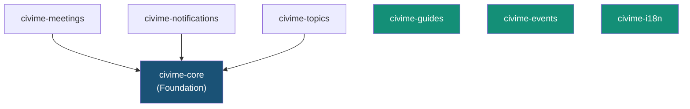

# WordPress Plugins & Theme Reference

Combined reference for all 7 WordPress plugins and the civime theme. This document covers plugin architecture patterns, per-plugin route/controller/template references, the admin dashboard, the theme design system, a scaffolding guide for new plugins, and the CSS/JS architecture.

---

## Plugin Architecture Overview

### Dependency Graph



civime-core is the shared foundation. civime-meetings, civime-notifications, and civime-topics all depend on `civime_api()` (the API client singleton provided by civime-core). civime-guides, civime-events, and civime-i18n are fully independent — they have no civime-core dependency and can be activated or deactivated without affecting any other plugin.

### Two Architecture Patterns

**Router / Controller / Template** (civime-meetings, civime-notifications, civime-topics)

Each plugin registers custom WordPress rewrite rules that map URL paths to query vars, then dispatches to PHP template files via a `template_include` filter. A controller class fetches data from the Access100 API via `civime_api()` and exposes it to the template via getters. Templates contain only HTML and presentation logic — no business logic. This pattern is described fully in [Scaffolding a New Plugin](#scaffolding-a-new-plugin) below and in [ROUTING.md](../architecture/ROUTING.md).

**Custom Post Type** (civime-guides, civime-events)

Each plugin registers a WordPress CPT via `register_post_type()` and a companion taxonomy. WordPress handles URL routing natively via the CPT slug. The plugin overrides the template via `template_include` using `is_singular()` / `is_post_type_archive()` checks. No API client dependency — content is authored directly in WordPress. See [ROUTING.md](../architecture/ROUTING.md) for the full URL-to-plugin table.

### Admin Menu Hierarchy

The CiviMe top-level admin menu is registered by `CiviMe_Admin_Subscribers` (dashicons-megaphone, position 30). Submenus appear in registration order:

| Submenu Label | Slug | Class | Notes |
|---|---|---|---|
| Subscribers | `civime` | `CiviMe_Admin_Subscribers` | First submenu — also the default menu label |
| Meetings Sync | `civime` (parent slug reuse) | `CiviMe_Admin_Sync` | Becomes the default CiviMe landing page |
| Meetings | `civime-meetings` | `CiviMe_Admin_Meetings` | |
| Reminders | `civime-reminders` | `CiviMe_Admin_Reminders` | |
| Councils | `civime-councils` | `CiviMe_Admin_Councils` | |
| Settings | `civime-settings` | `CiviMe_Settings` | |

**Critical ordering:** `CiviMe_Admin_Subscribers` must be instantiated before `CiviMe_Admin_Sync`. The Sync controller registers its submenu using the parent slug `civime` (which hijacks the top-level label and becomes the default landing page), but the parent menu must exist first. This ordering is hardcoded in `civime_core_init()`.

---

## civime-core (Foundation)

**Entry file:** `wp-content/plugins/civime-core/civime-core.php`
**Bootstrap hook:** `plugins_loaded`
**Status:** Complete

### Purpose

Shared foundation plugin providing the API client singleton, transient caching infrastructure, settings page, and the entire admin dashboard. All other API-consuming plugins depend on `civime_api()`. The plugin has no frontend routes of its own — it is purely a backend foundation.

### Constants

| Constant | Value | Purpose |
|---|---|---|
| `CIVIME_CORE_VERSION` | `0.1.0` | Plugin version string |
| `CIVIME_CORE_PATH` | *(absolute filesystem path)* | Used for `require` calls throughout |
| `CIVIME_CORE_URL` | *(absolute URL)* | Used for asset enqueue |

### Autoloader

civime-core registers a PSR-4-style autoloader for the `CiviMe_` prefix:

```
CiviMe_Foo_Bar  →  {CIVIME_CORE_PATH}includes/class-foo-bar.php
```

The autoloader strips the `CiviMe_` prefix, lowercases the remainder, replaces underscores with hyphens, and prepends `class-`. All other plugins register their own autoloader with their own prefix (e.g., `CiviMe_Meetings_`).

### Public Helper Functions

**`civime_api(): CiviMe_API_Client`**

Returns the singleton API client instance. Reads `civime_api_url` (default: `https://access100.app`) and `civime_api_key` from wp_options. Use this function in any plugin or template that needs to call the Access100 API.

```php
// Usage in any template or controller:
$meetings = civime_api()->get_meetings( [ 'limit' => 10 ] );
```

**`civime_get_option(string $key, mixed $default): mixed`**

Thin wrapper over `get_option()`. Used internally for reading plugin settings.

### API Client Reference

`CiviMe_API_Client` (`includes/class-api-client.php`) provides all ~46 methods for communicating with the Access100 API. Public GET methods use `cached_get()` (15-minute TTL, configurable). Admin methods always call `request()` directly — never cached. See [CACHING.md](../architecture/CACHING.md) for full behavior.

| Method | HTTP | Endpoint | Cached? |
|---|---|---|---|
| `get_meetings(array $args)` | GET | `/api/v1/meetings` | Yes |
| `get_meeting(string $state_id)` | GET | `/api/v1/meetings/{id}` | Yes |
| `get_meeting_summary(string $state_id)` | GET | `/api/v1/meetings/{id}/summary` | Yes |
| `get_meeting_ics_url(string $state_id)` | — | Returns URL string only | N/A |
| `get_councils(array $args)` | GET | `/api/v1/councils` | Yes |
| `get_council(int $id)` | GET | `/api/v1/councils/{id}` | Yes |
| `get_council_meetings(int $id, array $args)` | GET | `/api/v1/councils/{id}/meetings` | Yes |
| `get_council_profile(int $id)` | GET | `/api/v1/councils/{id}/profile` | Yes |
| `get_council_by_slug(string $slug)` | GET | `/api/v1/councils/slug/{slug}` | Yes |
| `get_council_authority(int $id)` | GET | `/api/v1/councils/{id}/authority` | Yes |
| `get_council_members(int $id)` | GET | `/api/v1/councils/{id}/members` | Yes |
| `get_council_vacancies(int $id)` | GET | `/api/v1/councils/{id}/vacancies` | Yes |
| `get_topics()` | GET | `/api/v1/topics` | Yes |
| `get_topic(string $slug)` | GET | `/api/v1/topics/{slug}` | Yes |
| `get_topic_meetings(string $slug, array $args)` | GET | `/api/v1/topics/{slug}/meetings` | Yes |
| `create_subscription(array $data)` | POST | `/api/v1/subscriptions` | No |
| `create_reminder(array $data)` | POST | `/api/v1/reminders` | No |
| `get_subscription(string $id, string $token)` | GET | `/api/v1/subscriptions/{id}` | No |
| `update_subscription(string $id, string $token, array $data)` | PATCH | `/api/v1/subscriptions/{id}` | No |
| `update_subscription_councils(string $id, string $token, int[] $ids)` | PUT | `/api/v1/subscriptions/{id}/councils` | No |
| `delete_subscription(string $id, string $token)` | DELETE | `/api/v1/subscriptions/{id}` | No |
| `get_admin_subscribers(array $args)` | GET | `/api/v1/admin/subscribers` | No |
| `create_admin_subscriber(array $data)` | POST | `/api/v1/admin/subscribers` | No |
| `update_admin_subscriber(int $user_id, array $data)` | PATCH | `/api/v1/admin/subscribers/{id}` | No |
| `deactivate_admin_subscriber(int $user_id)` | DELETE | `/api/v1/admin/subscribers/{id}` | No |
| `delete_admin_subscriber(int $user_id)` | DELETE | `/api/v1/admin/subscribers/{id}?hard=true` | No |
| `get_admin_reminders(array $args)` | GET | `/api/v1/admin/reminders` | No |
| `delete_admin_reminder(int $reminder_id)` | DELETE | `/api/v1/admin/reminders/{id}` | No |
| `get_admin_meetings(array $args)` | GET | `/api/v1/admin/meetings` | No |
| `check_admin_meeting_links(array $args)` | GET | `/api/v1/admin/meetings/check-links` | No |
| `update_admin_meeting(int $id, array $data)` | PATCH | `/api/v1/admin/meetings/{id}` | No |
| `get_admin_councils(array $args)` | GET | `/api/v1/admin/councils` | No |
| `get_admin_council(int $id)` | GET | `/api/v1/admin/councils/{id}` | No |
| `update_admin_council(int $id, array $data)` | PATCH | `/api/v1/admin/councils/{id}` | No |
| `create_admin_member(int $council_id, array $data)` | POST | `/api/v1/admin/councils/{id}/members` | No |
| `delete_admin_member(int $council_id, int $member_id)` | DELETE | `/api/v1/admin/councils/{id}/members/{mid}` | No |
| `create_admin_vacancy(int $council_id, array $data)` | POST | `/api/v1/admin/councils/{id}/vacancies` | No |
| `delete_admin_vacancy(int $council_id, int $vacancy_id)` | DELETE | `/api/v1/admin/councils/{id}/vacancies/{vid}` | No |
| `create_admin_authority(int $council_id, array $data)` | POST | `/api/v1/admin/councils/{id}/authority` | No |
| `delete_admin_authority(int $council_id, int $authority_id)` | DELETE | `/api/v1/admin/councils/{id}/authority/{aid}` | No |
| `get_admin_scraper_runs(array $args)` | GET | `/api/v1/admin/scraper/runs` | No |
| `trigger_admin_scrape()` | POST | `/api/v1/admin/scraper/trigger` | No |
| `trigger_admin_nco_scrape()` | POST | `/api/v1/admin/scraper/trigger-nco` | No |
| `trigger_admin_honolulu_boards_scrape()` | POST | `/api/v1/admin/scraper/trigger-honolulu-boards` | No |
| `trigger_admin_maui_scrape()` | POST | `/api/v1/admin/scraper/trigger-maui` | No |
| `get_health()` | GET | `/api/v1/health` | No |
| `get_stats()` | GET | `/api/v1/stats` | Yes |
| `flush_cache(?string $endpoint)` | — | Clears WordPress transients | N/A |

For full request/response schemas for these endpoints, see [ENDPOINTS.md](../api/ENDPOINTS.md#8-admin).

### Transient Cache Behavior

> **Cache implementation details** — See [CACHING.md](../architecture/CACHING.md) for the behavioral reference (what gets cached, bypass rules, TTL, clearing).

Key implementation facts for plugin developers:

- **Cache key formula:** `civime_cache_` + MD5(endpoint + JSON-encoded normalized args)
- **Default TTL:** 900 seconds (15 minutes), configurable via `civime_cache_ttl` wp_option
- **Rate-limit circuit breaker:** A 429 response from the API sets the `civime_cache_rate_limited` transient for 60 seconds (or the `Retry-After` header value). While active, all requests short-circuit with `WP_Error` rather than hitting the API.
- **Disabled entirely** when `civime_cache_enabled` option is `false`
- **Args normalization before hashing:** keys sorted alphabetically, comma-separated values also sorted — prevents cache misses from argument order variations
- **Flush by endpoint:** `flush_cache('/api/v1/meetings')` derives the same cache key and calls `delete_transient()`
- **Flush all:** SQL DELETE on `_transient_civime_cache_%` and `_transient_timeout_civime_cache_%` wildcard pattern

### Admin Dashboard

This section is a **developer reference** for the 5 admin controllers, not a site administrator usage guide. Each controller follows the same flow for form submissions: nonce verification → capability check → input sanitization → API call → POST-redirect-GET with notice query params.

#### Controller: Subscribers

**Class:** `CiviMe_Admin_Subscribers` (`includes/class-admin-subscribers.php`)

Registers the top-level CiviMe menu (dashicons-megaphone, position 30) and the Subscribers submenu. **Must be instantiated before `CiviMe_Admin_Sync`** — the Sync controller's submenu registration depends on this parent menu existing.

**Hooks registered:**

| Hook | Handler | Action |
|---|---|---|
| `admin_post_civime_create_subscriber` | `handle_create()` | Creates subscriber via API, redirects with notice |
| `admin_post_civime_update_subscriber` | `handle_update()` | Updates subscriber fields, redirects with notice |
| `admin_post_civime_deactivate_subscriber` | `handle_deactivate()` | Soft-deactivates subscriber, redirects with notice |
| `admin_post_civime_delete_subscriber` | `handle_delete()` | Hard-deletes subscriber, redirects with notice |

**API methods called:** `create_admin_subscriber()`, `update_admin_subscriber()`, `deactivate_admin_subscriber()`, `delete_admin_subscriber()` — see [ENDPOINTS.md](../api/ENDPOINTS.md#subscribers) for request/response schemas.

**Templates:**
- `admin/subscribers-page.php` — list view (default)
- `admin/subscriber-form.php` — add/edit form (selected when `$_GET['action']` is `add` or `edit`)

**Data flow (example: update):** Form POST → `admin_post_civime_update_subscriber` → nonce `civime_update_subscriber` verified → `current_user_can('manage_options')` checked → fields sanitized with `sanitize_text_field(wp_unslash())` → `update_admin_subscriber()` called → redirect to list with `?civime_updated=1` or `?civime_error=api_error`.

---

#### Controller: Sync

**Class:** `CiviMe_Admin_Sync` (`includes/class-admin-sync.php`)

Registers the Meetings Sync submenu using the parent slug `civime` — this makes Meetings Sync the default page that opens when clicking the top-level CiviMe menu item. Provides controls to trigger the Access100 scraper for each data source.

**Hooks registered:**

| Hook | Handler | Action |
|---|---|---|
| `admin_post_civime_trigger_sync` | `handle_trigger_sync()` | Triggers main scraper |
| `admin_post_civime_trigger_nco_sync` | `handle_trigger_nco_sync()` | Triggers NCO scraper |
| `admin_post_civime_trigger_honolulu_boards_sync` | `handle_trigger_honolulu_boards_sync()` | Triggers Honolulu Boards scraper |
| `admin_post_civime_trigger_maui_sync` | `handle_trigger_maui_sync()` | Triggers Maui scraper |

**API methods called:** `trigger_admin_scrape()`, `trigger_admin_nco_scrape()`, `trigger_admin_honolulu_boards_scrape()`, `trigger_admin_maui_scrape()` — see [ENDPOINTS.md](../api/ENDPOINTS.md#scraper).

**Post-trigger behavior:** After a successful scrape trigger, calls `flush_cache('/api/v1/meetings')` to invalidate stale meeting data from the transient cache.

**429 handling:** The Sync controller detects the `too_recent` error code in the API response and redirects with `?civime_error=too_recent` rather than the generic `api_error` — this lets the template show a more helpful message ("scraper was triggered recently, please wait").

**Template:** `admin/sync-page.php`

---

#### Controller: Meetings

**Class:** `CiviMe_Admin_Meetings` (`includes/class-admin-meetings.php`)

Registers the Meetings submenu (slug: `civime-meetings`). Provides a paginated meeting list with link-checking and inline meeting updates.

**Hooks registered:**

| Hook | Handler | Action |
|---|---|---|
| `admin_post_civime_check_meeting_links` | `handle_check_links()` | Triggers link checker, caches results in `civime_broken_links` transient for 1 hour |
| `admin_post_civime_update_meeting` | `handle_update_meeting()` | Updates a meeting's `state_id` field inline |

**API methods called:**
- `check_admin_meeting_links()` → [ENDPOINTS.md](../api/ENDPOINTS.md#meetings-1) — batched GET requests for all meeting links; results stored locally in a transient
- `update_admin_meeting(int $id, array $data)` → [ENDPOINTS.md](../api/ENDPOINTS.md#meetings-1) — updates meeting fields (currently used for `state_id` correction)

**Data flow (link check):** Form POST → nonce `civime_check_meeting_links` verified → `check_admin_meeting_links()` called → result stored in `civime_broken_links` transient (1 hour) → redirect with `?civime_checked=1`. On subsequent page loads, the template reads the transient to show results without re-running the check.

**Data flow (update meeting):** Form POST → nonce `civime_update_meeting` verified → `absint($meeting_id)` + `sanitize_text_field($new_state_id)` → `update_admin_meeting()` → `delete_transient('civime_broken_links')` (clears stale link results) → redirect with `?civime_updated=1`.

**Template:** `admin/meetings-page.php`

---

#### Controller: Reminders

**Class:** `CiviMe_Admin_Reminders` (`includes/class-admin-reminders.php`)

Registers the Reminders submenu (slug: `civime-reminders`). Provides a paginated list of meeting reminders with delete capability.

**Hooks registered:**

| Hook | Handler | Action |
|---|---|---|
| `admin_post_civime_delete_reminder` | `handle_delete()` | Hard-deletes a reminder record |

**API methods called:** `delete_admin_reminder(int $reminder_id)` → [ENDPOINTS.md](../api/ENDPOINTS.md#reminders-1).

**Data flow (delete):** Form POST → nonce `civime_delete_reminder` verified → `absint($reminder_id)` → `delete_admin_reminder()` → redirect with `?civime_deleted=1`.

**Template:** `admin/reminders-page.php`

---

#### Controller: Councils

**Class:** `CiviMe_Admin_Councils` (`includes/class-admin-councils.php`)

Registers the Councils submenu (slug: `civime-councils`). The most feature-rich admin controller — supports full CRUD on council profiles, members, vacancies, and legal authority citations.

**Hooks registered:**

| Hook | Handler | Action |
|---|---|---|
| `admin_post_civime_update_council` | `handle_update_council()` | Updates council profile (name, RSS URL, slug, description fields, topics, etc.) |
| `admin_post_civime_add_member` | `handle_add_member()` | Creates a new member record for a council |
| `admin_post_civime_delete_member` | `handle_delete_member()` | Removes a member record |
| `admin_post_civime_add_vacancy` | `handle_add_vacancy()` | Creates a vacancy (seat description, requirements, deadline, URL) |
| `admin_post_civime_delete_vacancy` | `handle_delete_vacancy()` | Removes a vacancy record |
| `admin_post_civime_add_authority` | `handle_add_authority()` | Creates a legal authority citation (citation, description, URL) |
| `admin_post_civime_delete_authority` | `handle_delete_authority()` | Removes an authority citation |

**API methods called:** `update_admin_council()`, `create_admin_member()`, `delete_admin_member()`, `create_admin_vacancy()`, `delete_admin_vacancy()`, `create_admin_authority()`, `delete_admin_authority()` — see [ENDPOINTS.md](../api/ENDPOINTS.md#councils-1) for request schemas.

**Templates:**
- `admin/councils-page.php` — list view (no `?council_id` param)
- `admin/council-edit-page.php` — full edit form (rendered when `?council_id` is set and `> 0`)

The `render_page()` method checks `$_GET['council_id']` to select the template — no separate admin page slug for edit vs. list.

**Sanitization detail (council update):** Text fields use `sanitize_text_field(wp_unslash())`, URL fields use `esc_url_raw(wp_unslash())`, textarea fields use `sanitize_textarea_field(wp_unslash())`, numeric fields use `absint()`, topic arrays use `array_map('absint', ...)`. See the source for the full field list including `slug`, `entity_type`, `level`, `jurisdiction`, `plain_description`, `why_care`, `testimony_instructions`, and more.

---

### Settings Page

**Class:** `CiviMe_Settings` (`includes/class-settings.php`)

Registers the Settings submenu (slug: `civime-settings`). Provides WordPress admin fields for configuring the API connection and cache behavior.

| Setting | wp_option key | Description |
|---|---|---|
| API URL | `civime_api_url` | Base URL for the Access100 API (default: `https://access100.app`) |
| API Key | `civime_api_key` | X-API-Key value sent on all server-to-server API calls |
| Cache TTL | `civime_cache_ttl` | Transient TTL in seconds (default: 900) |
| Cache Enabled | `civime_cache_enabled` | Toggle to disable all transient caching (boolean) |

**Template:** `admin/settings-page.php`

---

## civime-meetings

**Entry file:** `wp-content/plugins/civime-meetings/civime-meetings.php`
**Autoloader prefix:** `CiviMe_Meetings_`
**Bootstrap hook:** `plugins_loaded`
**Dependency:** civime-core (shows admin notice if `civime_api()` is unavailable)
**Status:** Complete

### Purpose

Public-facing meeting and council browser. Provides the `/meetings/` list, `/meetings/{id}/` detail, `/councils/` list, `/councils/{slug}/` profile pages, and an ICS calendar proxy. Also registers the notification routes `/meetings/subscribe/` and `/meetings/{id}/notify/` to control rewrite rule ordering relative to the catch-all meeting detail pattern.

### Routes

Registered by `CiviMe_Meetings_Router` via `add_rewrite_rule(..., 'top')` at `init` priority 10.

| URL Pattern | Query Var | Template |
|---|---|---|
| `/meetings/` | `civime_route=meetings-list` | `templates/meetings-list.php` |
| `/meetings/{id}/` | `civime_route=meeting-detail&civime_meeting_id={id}` | `templates/meeting-detail.php` |
| `/meetings/{id}/ics/` | `civime_route=meeting-ics&civime_meeting_id={id}` | Served inline, `exit()` after output |
| `/meetings/subscribe/` | `civime_notif_route=subscribe` | civime-notifications `templates/subscribe.php` |
| `/meetings/{id}/notify/` | `civime_notif_route=notify&civime_meeting_id={id}` | civime-notifications `templates/notify.php` |
| `/councils/` | `civime_route=councils-list` | `templates/councils-list.php` |
| `/councils/{slug}/` | `civime_route=council-profile&civime_council_slug={slug}` | `templates/council-profile.php` |

> `/meetings/subscribe/` and `/meetings/{id}/notify/` are registered by this router to ensure they appear before the `/meetings/{id}/` catch-all in WordPress's rewrite table. Their templates are rendered by civime-notifications, which uses the `civime_notif_route` query var. See [ROUTING.md](../architecture/ROUTING.md) for the complete URL-to-plugin table.

**Query vars registered:** `civime_route`, `civime_meeting_id`, `civime_council_slug`, `civime_notif_route`

### Controllers & Templates

| Class | Template | Purpose |
|---|---|---|
| `CiviMe_Meetings_Router` | — | Rewrite rules, template dispatch, 200 status override |
| `CiviMe_Meetings_List` | `templates/meetings-list.php` | Meetings list page controller |
| `CiviMe_Meetings_Detail` | `templates/meeting-detail.php` | Meeting detail page (includes AI summary section) |
| `CiviMe_Meetings_Councils_List` | `templates/councils-list.php` | Councils list page controller |
| `CiviMe_Meetings_Data_Mapper` | — | Transforms API response arrays for template consumption |

Council profile page uses `get_council_by_slug()` to look up the council, then `get_council_profile()`, `get_council_members()`, `get_council_vacancies()`, and `get_council_authority()` for the four profile sections — all via separate cached calls. Template: `templates/council-profile.php`.

### API Methods Called

All return cached responses via `cached_get()`. See [CACHING.md](../architecture/CACHING.md) for TTL and bypass behavior.

| Method | Endpoint | Purpose | Cached? |
|---|---|---|---|
| `get_meetings()` | `/api/v1/meetings` | Meetings list | Yes |
| `get_meeting()` | `/api/v1/meetings/{id}` | Meeting detail | Yes |
| `get_meeting_summary()` | `/api/v1/meetings/{id}/summary` | AI summary on detail page | Yes |
| `get_meeting_ics_url()` | — | Builds ICS download URL for proxy | N/A |
| `get_councils()` | `/api/v1/councils` | Councils list | Yes |
| `get_council_by_slug()` | `/api/v1/councils/slug/{slug}` | Council profile lookup | Yes |
| `get_council_profile()` | `/api/v1/councils/{id}/profile` | Council profile detail | Yes |
| `get_council_members()` | `/api/v1/councils/{id}/members` | Council member list | Yes |
| `get_council_vacancies()` | `/api/v1/councils/{id}/vacancies` | Open vacancies | Yes |
| `get_council_authority()` | `/api/v1/councils/{id}/authority` | Legal authority citations | Yes |

See [ENDPOINTS.md](../api/ENDPOINTS.md#2-meetings) and [ENDPOINTS.md](../api/ENDPOINTS.md#3-councils) for full request/response schemas.

### ICS Proxy

The `/meetings/{id}/ics/` route is handled entirely server-side. WordPress fetches the calendar file from the Access100 API (with the API key, which is never exposed to the browser), validates the ICS response body, enforces a 1 MB size limit, sanitizes the filename, and streams the file to the browser with `Content-Type: text/calendar`. The client never sees the API key.

### Assets

- `assets/css/meetings.css` — depends on `civime-theme` stylesheet
- `assets/js/meetings.js` — deferred, loaded in footer

Both are enqueued only when the `civime_route` query var is present on the current request.

---

## civime-notifications

**Entry file:** `wp-content/plugins/civime-notifications/civime-notifications.php`
**Autoloader prefix:** `CiviMe_Notifications_`
**Bootstrap hook:** `plugins_loaded`
**Dependency:** civime-core (requires `civime_api()`)
**Status:** Complete

### Purpose

Subscription management: subscribe form, per-meeting reminder, manage preferences, confirm email, and unsubscribe. Handles the complete subscriber lifecycle from first subscribe through unsubscribe — see [SUBSCRIPTION-LIFECYCLE.md](../api/SUBSCRIPTION-LIFECYCLE.md) for the full token flow and sequence diagrams.

### Routes

The notifications router registers at `init` **priority 11** (after civime-meetings at priority 10). Because `add_rewrite_rule('top')` prepends rules, later registrations appear first and therefore match first — notification-specific rules take priority over the meetings catch-all.

| URL Pattern | Query Var | Template |
|---|---|---|
| `/meetings/subscribe/` | `civime_notif_route=subscribe` | `templates/subscribe.php` |
| `/meetings/{id}/notify/` | `civime_notif_route=notify&civime_meeting_id={id}` | `templates/notify.php` |
| `/notifications/manage/` | `civime_notif_route=manage` | `templates/manage.php` |
| `/notifications/confirmed/` | `civime_notif_route=confirmed` | `templates/confirmed.php` |
| `/notifications/unsubscribed/` | `civime_notif_route=unsubscribed` | `templates/unsubscribed.php` |

> The `/meetings/subscribe/` and `/meetings/{id}/notify/` rules are registered by the civime-meetings router (not this router) to enforce correct ordering relative to the `/meetings/{id}/` catch-all. The notifications router only registers the `/notifications/*` rules. Both sets of rules use the `civime_notif_route` query var for template dispatch.

**Query var registered:** `civime_notif_route`

### Priority Ordering

> **Why priority 11?** WordPress's `add_rewrite_rule('top')` inserts rules at the top of the rewrite array — i.e., last-registered appears first in the array and matches first. civime-meetings registers at priority 10 (earlier), so its subscribe/notify stubs are added to the rewrite array first. civime-notifications registers at priority 11 (later), so its rules are prepended after, giving them higher matching priority. This is the mechanism that ensures notification-specific patterns beat the meeting detail catch-all (`^meetings/([^/]+)/?$`). See [ROUTING.md](../architecture/ROUTING.md) for the full routing mechanism explanation.

### Controllers & Templates

| Class | Template | Purpose |
|---|---|---|
| `CiviMe_Notifications_Router` | — | Rewrite rules + template dispatch |
| `CiviMe_Notifications_Subscribe` | `templates/subscribe.php` | Subscribe form controller (honeypot anti-spam) |
| `CiviMe_Notifications_Notify` | `templates/notify.php` | Per-meeting reminder form controller |
| `CiviMe_Notifications_Manage` | `templates/manage.php` | Subscription management (token-authenticated) |

Additional templates (no dedicated controller — rendered directly): `templates/confirmed.php`, `templates/unsubscribed.php`.

### API Methods Called

None of these methods use the transient cache — all are live requests. Subscription operations require real-time accuracy.

| Method | HTTP | Endpoint | Purpose |
|---|---|---|---|
| `create_subscription()` | POST | `/api/v1/subscriptions` | Subscribe form submission |
| `create_reminder()` | POST | `/api/v1/reminders` | Per-meeting notify form submission |
| `get_subscription()` | GET | `/api/v1/subscriptions/{id}` | Load preferences for manage page |
| `update_subscription()` | PATCH | `/api/v1/subscriptions/{id}` | Save preference updates |
| `update_subscription_councils()` | PUT | `/api/v1/subscriptions/{id}/councils` | Replace council subscription list |
| `delete_subscription()` | DELETE | `/api/v1/subscriptions/{id}` | Unsubscribe |

See [ENDPOINTS.md](../api/ENDPOINTS.md#5-subscriptions) and [SUBSCRIPTION-LIFECYCLE.md](../api/SUBSCRIPTION-LIFECYCLE.md) for full schemas and the end-to-end flow.

### Token Authentication

The manage page (`/notifications/manage/`) is token-authenticated. The `manage_token` (a 64-character hex string generated at subscription creation time) is passed as a `?token=` query parameter in every email link sent to subscribers. WordPress reads the token from the URL and passes it to `get_subscription()`. The token never expires and is never stored in WordPress — subscribers carry their own auth credential in every email link. See [SUBSCRIPTION-LIFECYCLE.md](../api/SUBSCRIPTION-LIFECYCLE.md#manage_token) for full token model documentation.

### Honeypot Anti-Spam

The subscribe form includes a hidden field that legitimate browsers leave empty. Submissions with the honeypot field filled are silently discarded — the controller returns without calling the API. No CAPTCHA is used.

### Assets

- `assets/css/notifications.css` — loaded on notification routes AND on `meeting-detail` pages (notification CTA on the detail page uses these styles)
- `assets/js/notifications.js` — deferred, loaded in footer; loaded only on notification routes

---

## civime-topics

**Entry file:** `wp-content/plugins/civime-topics/civime-topics.php`
**Autoloader prefix:** `CiviMe_Topics_`
**Bootstrap hook:** `plugins_loaded`
**Dependency:** civime-core (requires `civime_api()`)
**Status:** Active (in development)

### Purpose

Topic-based meeting browser. Provides a `/what-matters/` entry point (alias: `/topics/`) that shows a topic picker, and `/topics/{slug}/` detail pages with filtered meeting lists per topic.

### Routes

Registered at `init` default priority 10.

| URL Pattern | Query Var | Template |
|---|---|---|
| `/what-matters/` | `civime_route=topic-picker` | `templates/topic-picker.php` |
| `/topics/` | `civime_route=topic-picker` | `templates/topic-picker.php` (alias) |
| `/topics/{slug}/` | `civime_route=topic-page&civime_topic_slug={slug}` | `templates/topic-page.php` |

Both `/what-matters/` and `/topics/` resolve to the same `topic-picker` route and render the same template. This gives the site a friendly entry-point URL (`/what-matters/`) while keeping the canonical topic namespace at `/topics/`.

**Query vars registered:** `civime_route`, `civime_topic_slug`

### Controllers & Templates

| Class | Template | Purpose |
|---|---|---|
| `CiviMe_Topics_Router` | — | Rewrite rules + template dispatch |
| `CiviMe_Topics_Picker` | `templates/topic-picker.php` | Topic picker — shortcode or direct render |

**Template:** `templates/topic-page.php` — topic detail page (no dedicated controller class — uses `civime_api()` directly in template or via a shared controller).

### API Methods Called

All return cached responses.

| Method | Endpoint | Purpose | Cached? |
|---|---|---|---|
| `get_topics()` | `/api/v1/topics` | Topic picker list | Yes |
| `get_topic(string $slug)` | `/api/v1/topics/{slug}` | Topic detail | Yes |
| `get_topic_meetings(string $slug, array $args)` | `/api/v1/topics/{slug}/meetings` | Filtered meeting list for topic page | Yes |

See [ENDPOINTS.md](../api/ENDPOINTS.md#4-topics) for schemas.

### Asset Integration with Meetings Page

- `assets/css/topics.css` — loaded on topic routes
- `assets/js/topics.js` — deferred; loaded on topic routes **and** on `civime_route=meetings-list`

The topics JS integrates with the meeting list's filter bar to enable topic-based filtering from the main meetings page. Both plugins must be active for the filter to appear.
