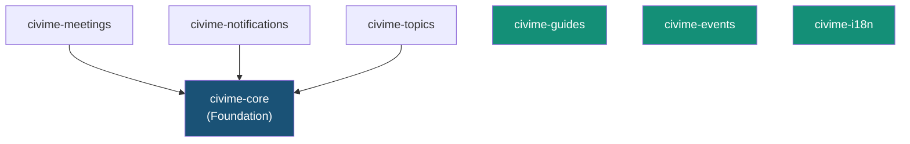

# WordPress Plugins & Theme Reference

Combined reference for all 7 WordPress plugins and the civime theme. This document covers plugin architecture patterns, per-plugin route/controller/template references, the admin dashboard, the theme design system, a scaffolding guide for new plugins, and the CSS/JS architecture.

---

## Plugin Architecture Overview

### Dependency Graph



civime-core is the shared foundation. civime-meetings, civime-notifications, and civime-topics all depend on `civime_api()` (the API client singleton provided by civime-core). civime-guides, civime-events, and civime-i18n are fully independent — they have no civime-core dependency and can be activated or deactivated without affecting any other plugin.

### Two Architecture Patterns

**Router / Controller / Template** (civime-meetings, civime-notifications, civime-topics)

Each plugin registers custom WordPress rewrite rules that map URL paths to query vars, then dispatches to PHP template files via a `template_include` filter. A controller class fetches data from the Access100 API via `civime_api()` and exposes it to the template via getters. Templates contain only HTML and presentation logic — no business logic. This pattern is described fully in [Scaffolding a New Plugin](#scaffolding-a-new-plugin) below and in [ROUTING.md](../architecture/ROUTING.md).

**Custom Post Type** (civime-guides, civime-events)

Each plugin registers a WordPress CPT via `register_post_type()` and a companion taxonomy. WordPress handles URL routing natively via the CPT slug. The plugin overrides the template via `template_include` using `is_singular()` / `is_post_type_archive()` checks. No API client dependency — content is authored directly in WordPress. See [ROUTING.md](../architecture/ROUTING.md) for the full URL-to-plugin table.

### Admin Menu Hierarchy

The CiviMe top-level admin menu is registered by `CiviMe_Admin_Subscribers` (dashicons-megaphone, position 30). Submenus appear in registration order:

| Submenu Label | Slug | Class | Notes |
|---|---|---|---|
| Subscribers | `civime` | `CiviMe_Admin_Subscribers` | First submenu — also the default menu label |
| Meetings Sync | `civime` (parent slug reuse) | `CiviMe_Admin_Sync` | Becomes the default CiviMe landing page |
| Meetings | `civime-meetings` | `CiviMe_Admin_Meetings` | |
| Reminders | `civime-reminders` | `CiviMe_Admin_Reminders` | |
| Councils | `civime-councils` | `CiviMe_Admin_Councils` | |
| Settings | `civime-settings` | `CiviMe_Settings` | |

**Critical ordering:** `CiviMe_Admin_Subscribers` must be instantiated before `CiviMe_Admin_Sync`. The Sync controller registers its submenu using the parent slug `civime` (which hijacks the top-level label and becomes the default landing page), but the parent menu must exist first. This ordering is hardcoded in `civime_core_init()`.

---

## civime-core (Foundation)

**Entry file:** `wp-content/plugins/civime-core/civime-core.php`
**Bootstrap hook:** `plugins_loaded`
**Status:** Complete

### Purpose

Shared foundation plugin providing the API client singleton, transient caching infrastructure, settings page, and the entire admin dashboard. All other API-consuming plugins depend on `civime_api()`. The plugin has no frontend routes of its own — it is purely a backend foundation.

### Constants

| Constant | Value | Purpose |
|---|---|---|
| `CIVIME_CORE_VERSION` | `0.1.0` | Plugin version string |
| `CIVIME_CORE_PATH` | *(absolute filesystem path)* | Used for `require` calls throughout |
| `CIVIME_CORE_URL` | *(absolute URL)* | Used for asset enqueue |

### Autoloader

civime-core registers a PSR-4-style autoloader for the `CiviMe_` prefix:

```
CiviMe_Foo_Bar  →  {CIVIME_CORE_PATH}includes/class-foo-bar.php
```

The autoloader strips the `CiviMe_` prefix, lowercases the remainder, replaces underscores with hyphens, and prepends `class-`. All other plugins register their own autoloader with their own prefix (e.g., `CiviMe_Meetings_`).

### Public Helper Functions

**`civime_api(): CiviMe_API_Client`**

Returns the singleton API client instance. Reads `civime_api_url` (default: `https://access100.app`) and `civime_api_key` from wp_options. Use this function in any plugin or template that needs to call the Access100 API.

```php
// Usage in any template or controller:
$meetings = civime_api()->get_meetings( [ 'limit' => 10 ] );
```

**`civime_get_option(string $key, mixed $default): mixed`**

Thin wrapper over `get_option()`. Used internally for reading plugin settings.

### API Client Reference

`CiviMe_API_Client` (`includes/class-api-client.php`) provides all ~46 methods for communicating with the Access100 API. Public GET methods use `cached_get()` (15-minute TTL, configurable). Admin methods always call `request()` directly — never cached. See [CACHING.md](../architecture/CACHING.md) for full behavior.

| Method | HTTP | Endpoint | Cached? |
|---|---|---|---|
| `get_meetings(array $args)` | GET | `/api/v1/meetings` | Yes |
| `get_meeting(string $state_id)` | GET | `/api/v1/meetings/{id}` | Yes |
| `get_meeting_summary(string $state_id)` | GET | `/api/v1/meetings/{id}/summary` | Yes |
| `get_meeting_ics_url(string $state_id)` | — | Returns URL string only | N/A |
| `get_councils(array $args)` | GET | `/api/v1/councils` | Yes |
| `get_council(int $id)` | GET | `/api/v1/councils/{id}` | Yes |
| `get_council_meetings(int $id, array $args)` | GET | `/api/v1/councils/{id}/meetings` | Yes |
| `get_council_profile(int $id)` | GET | `/api/v1/councils/{id}/profile` | Yes |
| `get_council_by_slug(string $slug)` | GET | `/api/v1/councils/slug/{slug}` | Yes |
| `get_council_authority(int $id)` | GET | `/api/v1/councils/{id}/authority` | Yes |
| `get_council_members(int $id)` | GET | `/api/v1/councils/{id}/members` | Yes |
| `get_council_vacancies(int $id)` | GET | `/api/v1/councils/{id}/vacancies` | Yes |
| `get_topics()` | GET | `/api/v1/topics` | Yes |
| `get_topic(string $slug)` | GET | `/api/v1/topics/{slug}` | Yes |
| `get_topic_meetings(string $slug, array $args)` | GET | `/api/v1/topics/{slug}/meetings` | Yes |
| `create_subscription(array $data)` | POST | `/api/v1/subscriptions` | No |
| `create_reminder(array $data)` | POST | `/api/v1/reminders` | No |
| `get_subscription(string $id, string $token)` | GET | `/api/v1/subscriptions/{id}` | No |
| `update_subscription(string $id, string $token, array $data)` | PATCH | `/api/v1/subscriptions/{id}` | No |
| `update_subscription_councils(string $id, string $token, int[] $ids)` | PUT | `/api/v1/subscriptions/{id}/councils` | No |
| `delete_subscription(string $id, string $token)` | DELETE | `/api/v1/subscriptions/{id}` | No |
| `get_admin_subscribers(array $args)` | GET | `/api/v1/admin/subscribers` | No |
| `create_admin_subscriber(array $data)` | POST | `/api/v1/admin/subscribers` | No |
| `update_admin_subscriber(int $user_id, array $data)` | PATCH | `/api/v1/admin/subscribers/{id}` | No |
| `deactivate_admin_subscriber(int $user_id)` | DELETE | `/api/v1/admin/subscribers/{id}` | No |
| `delete_admin_subscriber(int $user_id)` | DELETE | `/api/v1/admin/subscribers/{id}?hard=true` | No |
| `get_admin_reminders(array $args)` | GET | `/api/v1/admin/reminders` | No |
| `delete_admin_reminder(int $reminder_id)` | DELETE | `/api/v1/admin/reminders/{id}` | No |
| `get_admin_meetings(array $args)` | GET | `/api/v1/admin/meetings` | No |
| `check_admin_meeting_links(array $args)` | GET | `/api/v1/admin/meetings/check-links` | No |
| `update_admin_meeting(int $id, array $data)` | PATCH | `/api/v1/admin/meetings/{id}` | No |
| `get_admin_councils(array $args)` | GET | `/api/v1/admin/councils` | No |
| `get_admin_council(int $id)` | GET | `/api/v1/admin/councils/{id}` | No |
| `update_admin_council(int $id, array $data)` | PATCH | `/api/v1/admin/councils/{id}` | No |
| `create_admin_member(int $council_id, array $data)` | POST | `/api/v1/admin/councils/{id}/members` | No |
| `delete_admin_member(int $council_id, int $member_id)` | DELETE | `/api/v1/admin/councils/{id}/members/{mid}` | No |
| `create_admin_vacancy(int $council_id, array $data)` | POST | `/api/v1/admin/councils/{id}/vacancies` | No |
| `delete_admin_vacancy(int $council_id, int $vacancy_id)` | DELETE | `/api/v1/admin/councils/{id}/vacancies/{vid}` | No |
| `create_admin_authority(int $council_id, array $data)` | POST | `/api/v1/admin/councils/{id}/authority` | No |
| `delete_admin_authority(int $council_id, int $authority_id)` | DELETE | `/api/v1/admin/councils/{id}/authority/{aid}` | No |
| `get_admin_scraper_runs(array $args)` | GET | `/api/v1/admin/scraper/runs` | No |
| `trigger_admin_scrape()` | POST | `/api/v1/admin/scraper/trigger` | No |
| `trigger_admin_nco_scrape()` | POST | `/api/v1/admin/scraper/trigger-nco` | No |
| `trigger_admin_honolulu_boards_scrape()` | POST | `/api/v1/admin/scraper/trigger-honolulu-boards` | No |
| `trigger_admin_maui_scrape()` | POST | `/api/v1/admin/scraper/trigger-maui` | No |
| `get_health()` | GET | `/api/v1/health` | No |
| `get_stats()` | GET | `/api/v1/stats` | Yes |
| `flush_cache(?string $endpoint)` | — | Clears WordPress transients | N/A |

For full request/response schemas for these endpoints, see [ENDPOINTS.md](../api/ENDPOINTS.md#8-admin).

### Transient Cache Behavior

> **Cache implementation details** — See [CACHING.md](../architecture/CACHING.md) for the behavioral reference (what gets cached, bypass rules, TTL, clearing).

Key implementation facts for plugin developers:

- **Cache key formula:** `civime_cache_` + MD5(endpoint + JSON-encoded normalized args)
- **Default TTL:** 900 seconds (15 minutes), configurable via `civime_cache_ttl` wp_option
- **Rate-limit circuit breaker:** A 429 response from the API sets the `civime_cache_rate_limited` transient for 60 seconds (or the `Retry-After` header value). While active, all requests short-circuit with `WP_Error` rather than hitting the API.
- **Disabled entirely** when `civime_cache_enabled` option is `false`
- **Args normalization before hashing:** keys sorted alphabetically, comma-separated values also sorted — prevents cache misses from argument order variations
- **Flush by endpoint:** `flush_cache('/api/v1/meetings')` derives the same cache key and calls `delete_transient()`
- **Flush all:** SQL DELETE on `_transient_civime_cache_%` and `_transient_timeout_civime_cache_%` wildcard pattern

### Admin Dashboard

This section is a **developer reference** for the 5 admin controllers, not a site administrator usage guide. Each controller follows the same flow for form submissions: nonce verification → capability check → input sanitization → API call → POST-redirect-GET with notice query params.

#### Controller: Subscribers

**Class:** `CiviMe_Admin_Subscribers` (`includes/class-admin-subscribers.php`)

Registers the top-level CiviMe menu (dashicons-megaphone, position 30) and the Subscribers submenu. **Must be instantiated before `CiviMe_Admin_Sync`** — the Sync controller's submenu registration depends on this parent menu existing.

**Hooks registered:**

| Hook | Handler | Action |
|---|---|---|
| `admin_post_civime_create_subscriber` | `handle_create()` | Creates subscriber via API, redirects with notice |
| `admin_post_civime_update_subscriber` | `handle_update()` | Updates subscriber fields, redirects with notice |
| `admin_post_civime_deactivate_subscriber` | `handle_deactivate()` | Soft-deactivates subscriber, redirects with notice |
| `admin_post_civime_delete_subscriber` | `handle_delete()` | Hard-deletes subscriber, redirects with notice |

**API methods called:** `create_admin_subscriber()`, `update_admin_subscriber()`, `deactivate_admin_subscriber()`, `delete_admin_subscriber()` — see [ENDPOINTS.md](../api/ENDPOINTS.md#subscribers) for request/response schemas.

**Templates:**
- `admin/subscribers-page.php` — list view (default)
- `admin/subscriber-form.php` — add/edit form (selected when `$_GET['action']` is `add` or `edit`)

**Data flow (example: update):** Form POST → `admin_post_civime_update_subscriber` → nonce `civime_update_subscriber` verified → `current_user_can('manage_options')` checked → fields sanitized with `sanitize_text_field(wp_unslash())` → `update_admin_subscriber()` called → redirect to list with `?civime_updated=1` or `?civime_error=api_error`.

---

#### Controller: Sync

**Class:** `CiviMe_Admin_Sync` (`includes/class-admin-sync.php`)

Registers the Meetings Sync submenu using the parent slug `civime` — this makes Meetings Sync the default page that opens when clicking the top-level CiviMe menu item. Provides controls to trigger the Access100 scraper for each data source.

**Hooks registered:**

| Hook | Handler | Action |
|---|---|---|
| `admin_post_civime_trigger_sync` | `handle_trigger_sync()` | Triggers main scraper |
| `admin_post_civime_trigger_nco_sync` | `handle_trigger_nco_sync()` | Triggers NCO scraper |
| `admin_post_civime_trigger_honolulu_boards_sync` | `handle_trigger_honolulu_boards_sync()` | Triggers Honolulu Boards scraper |
| `admin_post_civime_trigger_maui_sync` | `handle_trigger_maui_sync()` | Triggers Maui scraper |

**API methods called:** `trigger_admin_scrape()`, `trigger_admin_nco_scrape()`, `trigger_admin_honolulu_boards_scrape()`, `trigger_admin_maui_scrape()` — see [ENDPOINTS.md](../api/ENDPOINTS.md#scraper).

**Post-trigger behavior:** After a successful scrape trigger, calls `flush_cache('/api/v1/meetings')` to invalidate stale meeting data from the transient cache.

**429 handling:** The Sync controller detects the `too_recent` error code in the API response and redirects with `?civime_error=too_recent` rather than the generic `api_error` — this lets the template show a more helpful message ("scraper was triggered recently, please wait").

**Template:** `admin/sync-page.php`

---

#### Controller: Meetings

**Class:** `CiviMe_Admin_Meetings` (`includes/class-admin-meetings.php`)

Registers the Meetings submenu (slug: `civime-meetings`). Provides a paginated meeting list with link-checking and inline meeting updates.

**Hooks registered:**

| Hook | Handler | Action |
|---|---|---|
| `admin_post_civime_check_meeting_links` | `handle_check_links()` | Triggers link checker, caches results in `civime_broken_links` transient for 1 hour |
| `admin_post_civime_update_meeting` | `handle_update_meeting()` | Updates a meeting's `state_id` field inline |

**API methods called:**
- `check_admin_meeting_links()` → [ENDPOINTS.md](../api/ENDPOINTS.md#meetings-1) — batched GET requests for all meeting links; results stored locally in a transient
- `update_admin_meeting(int $id, array $data)` → [ENDPOINTS.md](../api/ENDPOINTS.md#meetings-1) — updates meeting fields (currently used for `state_id` correction)

**Data flow (link check):** Form POST → nonce `civime_check_meeting_links` verified → `check_admin_meeting_links()` called → result stored in `civime_broken_links` transient (1 hour) → redirect with `?civime_checked=1`. On subsequent page loads, the template reads the transient to show results without re-running the check.

**Data flow (update meeting):** Form POST → nonce `civime_update_meeting` verified → `absint($meeting_id)` + `sanitize_text_field($new_state_id)` → `update_admin_meeting()` → `delete_transient('civime_broken_links')` (clears stale link results) → redirect with `?civime_updated=1`.

**Template:** `admin/meetings-page.php`

---

#### Controller: Reminders

**Class:** `CiviMe_Admin_Reminders` (`includes/class-admin-reminders.php`)

Registers the Reminders submenu (slug: `civime-reminders`). Provides a paginated list of meeting reminders with delete capability.

**Hooks registered:**

| Hook | Handler | Action |
|---|---|---|
| `admin_post_civime_delete_reminder` | `handle_delete()` | Hard-deletes a reminder record |

**API methods called:** `delete_admin_reminder(int $reminder_id)` → [ENDPOINTS.md](../api/ENDPOINTS.md#reminders-1).

**Data flow (delete):** Form POST → nonce `civime_delete_reminder` verified → `absint($reminder_id)` → `delete_admin_reminder()` → redirect with `?civime_deleted=1`.

**Template:** `admin/reminders-page.php`

---

#### Controller: Councils

**Class:** `CiviMe_Admin_Councils` (`includes/class-admin-councils.php`)

Registers the Councils submenu (slug: `civime-councils`). The most feature-rich admin controller — supports full CRUD on council profiles, members, vacancies, and legal authority citations.

**Hooks registered:**

| Hook | Handler | Action |
|---|---|---|
| `admin_post_civime_update_council` | `handle_update_council()` | Updates council profile (name, RSS URL, slug, description fields, topics, etc.) |
| `admin_post_civime_add_member` | `handle_add_member()` | Creates a new member record for a council |
| `admin_post_civime_delete_member` | `handle_delete_member()` | Removes a member record |
| `admin_post_civime_add_vacancy` | `handle_add_vacancy()` | Creates a vacancy (seat description, requirements, deadline, URL) |
| `admin_post_civime_delete_vacancy` | `handle_delete_vacancy()` | Removes a vacancy record |
| `admin_post_civime_add_authority` | `handle_add_authority()` | Creates a legal authority citation (citation, description, URL) |
| `admin_post_civime_delete_authority` | `handle_delete_authority()` | Removes an authority citation |

**API methods called:** `update_admin_council()`, `create_admin_member()`, `delete_admin_member()`, `create_admin_vacancy()`, `delete_admin_vacancy()`, `create_admin_authority()`, `delete_admin_authority()` — see [ENDPOINTS.md](../api/ENDPOINTS.md#councils-1) for request schemas.

**Templates:**
- `admin/councils-page.php` — list view (no `?council_id` param)
- `admin/council-edit-page.php` — full edit form (rendered when `?council_id` is set and `> 0`)

The `render_page()` method checks `$_GET['council_id']` to select the template — no separate admin page slug for edit vs. list.

**Sanitization detail (council update):** Text fields use `sanitize_text_field(wp_unslash())`, URL fields use `esc_url_raw(wp_unslash())`, textarea fields use `sanitize_textarea_field(wp_unslash())`, numeric fields use `absint()`, topic arrays use `array_map('absint', ...)`. See the source for the full field list including `slug`, `entity_type`, `level`, `jurisdiction`, `plain_description`, `why_care`, `testimony_instructions`, and more.

---

### Settings Page

**Class:** `CiviMe_Settings` (`includes/class-settings.php`)

Registers the Settings submenu (slug: `civime-settings`). Provides WordPress admin fields for configuring the API connection and cache behavior.

| Setting | wp_option key | Description |
|---|---|---|
| API URL | `civime_api_url` | Base URL for the Access100 API (default: `https://access100.app`) |
| API Key | `civime_api_key` | X-API-Key value sent on all server-to-server API calls |
| Cache TTL | `civime_cache_ttl` | Transient TTL in seconds (default: 900) |
| Cache Enabled | `civime_cache_enabled` | Toggle to disable all transient caching (boolean) |

**Template:** `admin/settings-page.php`

---

## civime-meetings

**Entry file:** `wp-content/plugins/civime-meetings/civime-meetings.php`
**Autoloader prefix:** `CiviMe_Meetings_`
**Bootstrap hook:** `plugins_loaded`
**Dependency:** civime-core (shows admin notice if `civime_api()` is unavailable)
**Status:** Complete

### Purpose

Public-facing meeting and council browser. Provides the `/meetings/` list, `/meetings/{id}/` detail, `/councils/` list, `/councils/{slug}/` profile pages, and an ICS calendar proxy. Also registers the notification routes `/meetings/subscribe/` and `/meetings/{id}/notify/` to control rewrite rule ordering relative to the catch-all meeting detail pattern.

### Routes

Registered by `CiviMe_Meetings_Router` via `add_rewrite_rule(..., 'top')` at `init` priority 10.

| URL Pattern | Query Var | Template |
|---|---|---|
| `/meetings/` | `civime_route=meetings-list` | `templates/meetings-list.php` |
| `/meetings/{id}/` | `civime_route=meeting-detail&civime_meeting_id={id}` | `templates/meeting-detail.php` |
| `/meetings/{id}/ics/` | `civime_route=meeting-ics&civime_meeting_id={id}` | Served inline, `exit()` after output |
| `/meetings/subscribe/` | `civime_notif_route=subscribe` | civime-notifications `templates/subscribe.php` |
| `/meetings/{id}/notify/` | `civime_notif_route=notify&civime_meeting_id={id}` | civime-notifications `templates/notify.php` |
| `/councils/` | `civime_route=councils-list` | `templates/councils-list.php` |
| `/councils/{slug}/` | `civime_route=council-profile&civime_council_slug={slug}` | `templates/council-profile.php` |

> `/meetings/subscribe/` and `/meetings/{id}/notify/` are registered by this router to ensure they appear before the `/meetings/{id}/` catch-all in WordPress's rewrite table. Their templates are rendered by civime-notifications, which uses the `civime_notif_route` query var. See [ROUTING.md](../architecture/ROUTING.md) for the complete URL-to-plugin table.

**Query vars registered:** `civime_route`, `civime_meeting_id`, `civime_council_slug`, `civime_notif_route`

### Controllers & Templates

| Class | Template | Purpose |
|---|---|---|
| `CiviMe_Meetings_Router` | — | Rewrite rules, template dispatch, 200 status override |
| `CiviMe_Meetings_List` | `templates/meetings-list.php` | Meetings list page controller |
| `CiviMe_Meetings_Detail` | `templates/meeting-detail.php` | Meeting detail page (includes AI summary section) |
| `CiviMe_Meetings_Councils_List` | `templates/councils-list.php` | Councils list page controller |
| `CiviMe_Meetings_Data_Mapper` | — | Transforms API response arrays for template consumption |

Council profile page uses `get_council_by_slug()` to look up the council, then `get_council_profile()`, `get_council_members()`, `get_council_vacancies()`, and `get_council_authority()` for the four profile sections — all via separate cached calls. Template: `templates/council-profile.php`.

### API Methods Called

All return cached responses via `cached_get()`. See [CACHING.md](../architecture/CACHING.md) for TTL and bypass behavior.

| Method | Endpoint | Purpose | Cached? |
|---|---|---|---|
| `get_meetings()` | `/api/v1/meetings` | Meetings list | Yes |
| `get_meeting()` | `/api/v1/meetings/{id}` | Meeting detail | Yes |
| `get_meeting_summary()` | `/api/v1/meetings/{id}/summary` | AI summary on detail page | Yes |
| `get_meeting_ics_url()` | — | Builds ICS download URL for proxy | N/A |
| `get_councils()` | `/api/v1/councils` | Councils list | Yes |
| `get_council_by_slug()` | `/api/v1/councils/slug/{slug}` | Council profile lookup | Yes |
| `get_council_profile()` | `/api/v1/councils/{id}/profile` | Council profile detail | Yes |
| `get_council_members()` | `/api/v1/councils/{id}/members` | Council member list | Yes |
| `get_council_vacancies()` | `/api/v1/councils/{id}/vacancies` | Open vacancies | Yes |
| `get_council_authority()` | `/api/v1/councils/{id}/authority` | Legal authority citations | Yes |

See [ENDPOINTS.md](../api/ENDPOINTS.md#2-meetings) and [ENDPOINTS.md](../api/ENDPOINTS.md#3-councils) for full request/response schemas.

### ICS Proxy

The `/meetings/{id}/ics/` route is handled entirely server-side. WordPress fetches the calendar file from the Access100 API (with the API key, which is never exposed to the browser), validates the ICS response body, enforces a 1 MB size limit, sanitizes the filename, and streams the file to the browser with `Content-Type: text/calendar`. The client never sees the API key.

### Assets

- `assets/css/meetings.css` — depends on `civime-theme` stylesheet
- `assets/js/meetings.js` — deferred, loaded in footer

Both are enqueued only when the `civime_route` query var is present on the current request.

---

## civime-notifications

**Entry file:** `wp-content/plugins/civime-notifications/civime-notifications.php`
**Autoloader prefix:** `CiviMe_Notifications_`
**Bootstrap hook:** `plugins_loaded`
**Dependency:** civime-core (requires `civime_api()`)
**Status:** Complete

### Purpose

Subscription management: subscribe form, per-meeting reminder, manage preferences, confirm email, and unsubscribe. Handles the complete subscriber lifecycle from first subscribe through unsubscribe — see [SUBSCRIPTION-LIFECYCLE.md](../api/SUBSCRIPTION-LIFECYCLE.md) for the full token flow and sequence diagrams.

### Routes

The notifications router registers at `init` **priority 11** (after civime-meetings at priority 10). Because `add_rewrite_rule('top')` prepends rules, later registrations appear first and therefore match first — notification-specific rules take priority over the meetings catch-all.

| URL Pattern | Query Var | Template |
|---|---|---|
| `/meetings/subscribe/` | `civime_notif_route=subscribe` | `templates/subscribe.php` |
| `/meetings/{id}/notify/` | `civime_notif_route=notify&civime_meeting_id={id}` | `templates/notify.php` |
| `/notifications/manage/` | `civime_notif_route=manage` | `templates/manage.php` |
| `/notifications/confirmed/` | `civime_notif_route=confirmed` | `templates/confirmed.php` |
| `/notifications/unsubscribed/` | `civime_notif_route=unsubscribed` | `templates/unsubscribed.php` |

> The `/meetings/subscribe/` and `/meetings/{id}/notify/` rules are registered by the civime-meetings router (not this router) to enforce correct ordering relative to the `/meetings/{id}/` catch-all. The notifications router only registers the `/notifications/*` rules. Both sets of rules use the `civime_notif_route` query var for template dispatch.

**Query var registered:** `civime_notif_route`

### Priority Ordering

> **Why priority 11?** WordPress's `add_rewrite_rule('top')` inserts rules at the top of the rewrite array — i.e., last-registered appears first in the array and matches first. civime-meetings registers at priority 10 (earlier), so its subscribe/notify stubs are added to the rewrite array first. civime-notifications registers at priority 11 (later), so its rules are prepended after, giving them higher matching priority. This is the mechanism that ensures notification-specific patterns beat the meeting detail catch-all (`^meetings/([^/]+)/?$`). See [ROUTING.md](../architecture/ROUTING.md) for the full routing mechanism explanation.

### Controllers & Templates

| Class | Template | Purpose |
|---|---|---|
| `CiviMe_Notifications_Router` | — | Rewrite rules + template dispatch |
| `CiviMe_Notifications_Subscribe` | `templates/subscribe.php` | Subscribe form controller (honeypot anti-spam) |
| `CiviMe_Notifications_Notify` | `templates/notify.php` | Per-meeting reminder form controller |
| `CiviMe_Notifications_Manage` | `templates/manage.php` | Subscription management (token-authenticated) |

Additional templates (no dedicated controller — rendered directly): `templates/confirmed.php`, `templates/unsubscribed.php`.

### API Methods Called

None of these methods use the transient cache — all are live requests. Subscription operations require real-time accuracy.

| Method | HTTP | Endpoint | Purpose |
|---|---|---|---|
| `create_subscription()` | POST | `/api/v1/subscriptions` | Subscribe form submission |
| `create_reminder()` | POST | `/api/v1/reminders` | Per-meeting notify form submission |
| `get_subscription()` | GET | `/api/v1/subscriptions/{id}` | Load preferences for manage page |
| `update_subscription()` | PATCH | `/api/v1/subscriptions/{id}` | Save preference updates |
| `update_subscription_councils()` | PUT | `/api/v1/subscriptions/{id}/councils` | Replace council subscription list |
| `delete_subscription()` | DELETE | `/api/v1/subscriptions/{id}` | Unsubscribe |

See [ENDPOINTS.md](../api/ENDPOINTS.md#5-subscriptions) and [SUBSCRIPTION-LIFECYCLE.md](../api/SUBSCRIPTION-LIFECYCLE.md) for full schemas and the end-to-end flow.

### Token Authentication

The manage page (`/notifications/manage/`) is token-authenticated. The `manage_token` (a 64-character hex string generated at subscription creation time) is passed as a `?token=` query parameter in every email link sent to subscribers. WordPress reads the token from the URL and passes it to `get_subscription()`. The token never expires and is never stored in WordPress — subscribers carry their own auth credential in every email link. See [SUBSCRIPTION-LIFECYCLE.md](../api/SUBSCRIPTION-LIFECYCLE.md#manage_token) for full token model documentation.

### Honeypot Anti-Spam

The subscribe form includes a hidden field that legitimate browsers leave empty. Submissions with the honeypot field filled are silently discarded — the controller returns without calling the API. No CAPTCHA is used.

### Assets

- `assets/css/notifications.css` — loaded on notification routes AND on `meeting-detail` pages (notification CTA on the detail page uses these styles)
- `assets/js/notifications.js` — deferred, loaded in footer; loaded only on notification routes

---

## civime-topics

**Entry file:** `wp-content/plugins/civime-topics/civime-topics.php`
**Autoloader prefix:** `CiviMe_Topics_`
**Bootstrap hook:** `plugins_loaded`
**Dependency:** civime-core (requires `civime_api()`)
**Status:** Active (in development)

### Purpose

Topic-based meeting browser. Provides a `/what-matters/` entry point (alias: `/topics/`) that shows a topic picker, and `/topics/{slug}/` detail pages with filtered meeting lists per topic.

### Routes

Registered at `init` default priority 10.

| URL Pattern | Query Var | Template |
|---|---|---|
| `/what-matters/` | `civime_route=topic-picker` | `templates/topic-picker.php` |
| `/topics/` | `civime_route=topic-picker` | `templates/topic-picker.php` (alias) |
| `/topics/{slug}/` | `civime_route=topic-page&civime_topic_slug={slug}` | `templates/topic-page.php` |

Both `/what-matters/` and `/topics/` resolve to the same `topic-picker` route and render the same template. This gives the site a friendly entry-point URL (`/what-matters/`) while keeping the canonical topic namespace at `/topics/`.

**Query vars registered:** `civime_route`, `civime_topic_slug`

### Controllers & Templates

| Class | Template | Purpose |
|---|---|---|
| `CiviMe_Topics_Router` | — | Rewrite rules + template dispatch |
| `CiviMe_Topics_Picker` | `templates/topic-picker.php` | Topic picker — shortcode or direct render |

**Template:** `templates/topic-page.php` — topic detail page (no dedicated controller class — uses `civime_api()` directly in template or via a shared controller).

### API Methods Called

All return cached responses.

| Method | Endpoint | Purpose | Cached? |
|---|---|---|---|
| `get_topics()` | `/api/v1/topics` | Topic picker list | Yes |
| `get_topic(string $slug)` | `/api/v1/topics/{slug}` | Topic detail | Yes |
| `get_topic_meetings(string $slug, array $args)` | `/api/v1/topics/{slug}/meetings` | Filtered meeting list for topic page | Yes |

See [ENDPOINTS.md](../api/ENDPOINTS.md#4-topics) for schemas.

### Asset Integration with Meetings Page

- `assets/css/topics.css` — loaded on topic routes
- `assets/js/topics.js` — deferred; loaded on topic routes **and** on `civime_route=meetings-list`

The topics JS integrates with the meeting list's filter bar to enable topic-based filtering from the main meetings page. Both plugins must be active for the filter to appear.

---

## civime-guides

**Entry file:** `wp-content/plugins/civime-guides/civime-guides.php`
**Autoloader prefix:** `CiviMe_Guides_`
**Bootstrap hook:** `init`
**No civime-core dependency** — standalone plugin
**Status:** Active (in development)

### Purpose

WordPress Custom Post Type for civic participation guides — how to give testimony, write letters, understand the legislative process, and more. Content is authored directly in WordPress; the plugin does not call the Access100 API. Guides can be organized into categories and filtered by locale.

### CPT: civime_guide

- **Slug:** `civime_guide`
- **Public archive:** `/guides/` (rewrite slug: `guides`, no front)
- **Supports:** `title`, `editor`, `excerpt`, `thumbnail`, `revisions`, `page-attributes`
- **Capability type:** `guide` / `guides` (custom capabilities — not the default `post`)
- **Map meta cap:** `true` — WordPress maps primitive capabilities automatically
- **Custom capabilities granted on activation:** `edit_guides`, `edit_others_guides`, `publish_guides`, `read_private_guides`, `delete_guides`, `delete_others_guides`, `delete_published_guides`, `edit_published_guides` — granted to **Administrator** and **Editor** roles

### Taxonomy: guide_category

Hierarchical taxonomy attached to `civime_guide`. Category terms are seeded on plugin activation via `CiviMe_Guides_Post_Type::seed_terms()`. Term names are translated for the active locale by civime-i18n's `CiviMe_I18n_Locale::translate_term()` filter.

Default seeded categories: Testimony, Advocacy, Getting Started, Voting & Elections, Compliance.

### Classes

| Class | File | Purpose |
|---|---|---|
| `CiviMe_Guides_Post_Type` | `includes/class-post-type.php` | CPT + taxonomy registration; `template_include` override; `body_class` filter; locale-based `pre_get_posts` filter |
| `CiviMe_Guides_Archive` | `includes/class-archive.php` | Archive page controller |
| `CiviMe_Guides_Single` | `includes/class-single.php` | Single guide controller |
| `CiviMe_Guides_Seeder` | `includes/class-seeder.php` | Seeds initial guide content on plugin activation |

### Templates

| File | When Used |
|---|---|
| `templates/archive-guide.php` | `is_post_type_archive('civime_guide')` or `is_tax('guide_category')` |
| `templates/single-guide.php` | `is_singular('civime_guide')` |

Template dispatch is handled by the `template_include` filter in `CiviMe_Guides_Post_Type`. The filter checks `is_post_type_archive()` and `is_singular()` before returning the custom template path.

### Assets

- `assets/css/guides.css` — depends on `civime-theme` stylesheet

Enqueued only on guide archive, guide category taxonomy, and single guide pages (checked via `is_post_type_archive()`, `is_tax()`, `is_singular()`).

---

## civime-events

**Entry file:** `wp-content/plugins/civime-events/civime-events.php`
**Autoloader prefix:** `CiviMe_Events_`
**Bootstrap hooks:** `init` (post type registration) + `plugins_loaded` (meta box)
**No civime-core dependency** — standalone plugin
**Status:** Active (in development)

### Purpose

WordPress Custom Post Type for civic community events — letter writing parties, info sessions, ambassador meetups, and more. Content is authored directly in WordPress; the plugin does not call the Access100 API. Events include custom meta fields for date, location, and related details.

### CPT: civime_event

- **Slug:** `civime_event`
- **Public archive:** `/events/` (rewrite slug: `events`, no front)
- **Supports:** `title`, `editor`, `excerpt`, `thumbnail`, `revisions`
- **Capability type:** default (`post`) — no custom capability type

### Taxonomy: event_type

Hierarchical taxonomy attached to `civime_event`. Terms are seeded on plugin activation via `CiviMe_Events_Post_Type::seed_terms()`. Archive queries are modified via `pre_get_posts` to control ordering (upcoming events sorted by event date).

### Classes

| Class | File | Purpose |
|---|---|---|
| `CiviMe_Events_Post_Type` | `includes/class-post-type.php` | CPT + taxonomy registration; `template_include` override; `body_class` filter; `pre_get_posts` for archive ordering |
| `CiviMe_Events_Meta_Box` | `includes/class-meta-box.php` | Custom meta fields: event date, location, and additional details (registered via `plugins_loaded`) |
| `CiviMe_Events_Archive` | `includes/class-archive.php` | Archive page controller |
| `CiviMe_Events_Single` | `includes/class-single.php` | Single event controller |

### Templates

| File | When Used |
|---|---|
| `templates/archive-event.php` | `is_post_type_archive('civime_event')` or `is_tax('event_type')` |
| `templates/single-event.php` | `is_singular('civime_event')` |

Template dispatch is handled by the `template_include` filter in `CiviMe_Events_Post_Type`.

### Assets

- `assets/css/events.css` — depends on `civime-theme` stylesheet

Enqueued only on event archive, event type taxonomy, and single event pages.

---

## civime-i18n

**Entry file:** `wp-content/plugins/civime-i18n/civime-i18n.php`
**Autoloader prefix:** `CiviMe_I18n_`
**Bootstrap hook:** `plugins_loaded` at **priority 5**
**No civime-core dependency** — standalone plugin
**Status:** Active (in development)

### Purpose

Internationalization plugin supporting Hawaii's 15 OLA (Official Languages Act) languages plus English (16 locales total). Detects the active locale from a `?lang=` URL parameter or `civime_lang` cookie, switches the WordPress locale, loads text domains centrally, provides a language picker widget/shortcode, and outputs `<link rel="alternate" hreflang>` tags for SEO. Menu items and taxonomy terms are translated in place via WordPress filters.

### Languages Supported

16 locales (English + 15 OLA languages):

| Slug | Language | Native Name | WP Locale | WP Language Pack |
|---|---|---|---|---|
| `en` | English | English | `en_US` | Yes |
| `haw` | Hawaiian | ʻŌlelo Hawaiʻi | `haw` | No |
| `tl` | Tagalog | Tagalog | `tl` | Yes |
| `ja` | Japanese | 日本語 | `ja` | Yes |
| `ilo` | Ilokano | Ilokano | `ilo` | No |
| `zh-hans` | Simplified Chinese | 简体中文 | `zh_CN` | Yes |
| `zh-hant` | Traditional Chinese | 繁體中文 | `zh_TW` | Yes |
| `ko` | Korean | 한국어 | `ko_KR` | Yes |
| `es` | Spanish | Español | `es_ES` | Yes |
| `vi` | Vietnamese | Tiếng Việt | `vi` | Yes |
| `sm` | Samoan | Gagana Sāmoa | `sm` | No |
| `to` | Tongan | Lea Fakatonga | `to` | No |
| `mah` | Marshallese | Marshallese | `mah` | No |
| `chk` | Chuukese | Chuukese | `chk` | No |
| `th` | Thai | ไทย | `th` | Yes |
| `ceb` | Cebuano | Cebuano | `ceb` | No |

For languages without a WordPress language pack, `CiviMe_I18n_Wp_Locale_Compat` applies custom month and weekday name overrides after `switch_to_locale()`.

### Init Priority

> **WARNING — Bootstrap at priority 5:** `civime_i18n_init` is registered on `plugins_loaded` at **priority 5**, not the default priority 10. This is critical: it ensures the locale is detected and switched before any other plugin loads its text domain at default priority 10. If civime-i18n ran at priority 10 or later, plugins that call `load_plugin_textdomain()` early would load the wrong locale's strings.
>
> **Implication for new plugins:** Any civime plugin that loads its own text domain at `plugins_loaded` (default priority 10) will correctly pick up the locale that civime-i18n has already set. Do not bootstrap new plugins at priority 5 or lower — leave that slot for civime-i18n.

### Locale Detection Order

1. `?lang=` URL query parameter (validated against LOCALES registry)
2. `civime_lang` cookie (set for 7 days when a `?lang=` param is processed)
3. Falls back to `en` if neither is present or valid

### Classes Reference

| Class | File | Purpose |
|---|---|---|
| `CiviMe_I18n_Locale` | `includes/class-locale.php` | Detects and switches WordPress locale; loads all CiviMe text domains centrally; translates nav menu items, tagline, and taxonomy terms via filters |
| `CiviMe_I18n_Page_Content` | `includes/class-page-content.php` | Serves translated static page content |
| `CiviMe_I18n_Hreflang` | `includes/class-hreflang.php` | Outputs `<link rel="alternate" hreflang="...">` tags in `<head>` for all 16 locales (SEO) |
| `CiviMe_I18n_Switcher` | `includes/class-switcher.php` | Language picker rendered as a widget or shortcode |
| `CiviMe_I18n_Topic_Names` | `includes/class-topic-names.php` | Translated topic label strings for Access100 topic slugs |
| `CiviMe_I18n_Url_Helper` | `includes/class-url-helper.php` | URL construction for language-variant links (adds `?lang=` param) |
| `CiviMe_I18n_Pot_Parser` | `includes/class-pot-parser.php` | Parses POT files for string extraction during translation workflow |
| `CiviMe_I18n_Wp_Locale_Compat` | `includes/class-wp-locale-compat.php` | Maps OLA language codes to WP locale identifiers; applies custom month/weekday names for languages without WP packs |
| `CiviMe_I18n_Admin_Languages` | `includes/class-admin-languages.php` | Admin page for language settings configuration |

### Admin Page

`admin/languages-page.php` — rendered by `CiviMe_I18n_Admin_Languages` when `is_admin()` is true. Instantiated inside `civime_i18n_init()` only on admin requests.

### Assets

- `assets/css/i18n.css` — depends on `civime-theme` stylesheet

Enqueued unconditionally on **all front-end pages** (no query var check). The language picker is always available in the site header regardless of which page the user is viewing.

---

## Theme: civime

**Entry file:** `wp-content/themes/civime/style.css` (header only)
**Functions:** `wp-content/themes/civime/functions.php`
**Status:** Complete

### Purpose

The WordPress theme providing the shell (header, footer, primary nav, mobile nav, footer nav), design system (CSS custom properties), dark mode with flash prevention, icon system, security headers, and editor integration. All plugins inherit these tokens and layout primitives — plugin stylesheets declare `civime-theme` as a dependency to ensure the design system loads before any plugin CSS.

### Design System

#### Color Tokens (Light + Dark)

All colors are defined as CSS custom properties on `:root`. Dark mode overrides are applied via `@media (prefers-color-scheme: dark)` with `:root:not([data-theme="light"])` selector, and can be manually overridden via the `data-theme` attribute on `<html>`.

| Property | Light | Dark | Purpose |
|---|---|---|---|
| `--color-primary` | `#1a5276` | `#5dade2` | Ocean Blue — links, buttons |
| `--color-primary-hover` | `#154360` | `#7ec8e3` | Hover state for primary elements |
| `--color-secondary` | `#148f77` | `#48c9b0` | Reef Teal — secondary actions |
| `--color-accent` | `#d4721a` | `#f0a04b` | Sunset Orange — highlights, CTAs |
| `--color-bg` | `#fafbfc` | `#0f1419` | Page background |
| `--color-surface` | `#ffffff` | `#1a2332` | Card/panel background |
| `--color-text` | `#1a1a2e` | `#e8edf2` | Body text |
| `--color-text-secondary` | `#4a5568` | `#94a3b8` | Muted/supporting text |
| `--color-border` | `#e2e8f0` | `#2d3748` | Borders and dividers |
| `--color-success` | `#27ae60` | `#27ae60` | Success states |
| `--color-warning` | `#f39c12` | `#f39c12` | Warning states |
| `--color-error` | `#c0392b` | `#c0392b` | Error states |

#### Typography

| Property | Value | Purpose |
|---|---|---|
| `--font-heading` | `'Lexend', system-ui, sans-serif` | All headings (h1–h6) |
| `--font-body` | `'Source Sans 3', system-ui, sans-serif` | Body text |
| `--font-size-base` | `1.125rem` (18px) | Base font size |
| `--line-height-body` | `1.6` | Body text line height |
| `--line-height-heading` | `1.2` | Heading line height |

**Font size scale:**

| Token | Size |
|---|---|
| `--font-size-xs` | 12px |
| `--font-size-sm` | 14px |
| `--font-size-base` | 18px |
| `--font-size-lg` | 20px |
| `--font-size-xl` | 24px |
| `--font-size-2xl` | 30px |
| `--font-size-3xl` | 36px |
| `--font-size-4xl` | 48px |
| `--font-size-5xl` | 60px |

**Font loading:** Google Fonts via `fonts.googleapis.com` with `preconnect` to `fonts.gstatic.com` and `display=swap` for performance.

#### Spacing Scale

8px grid. `--space-1` (4px) through `--space-24` (96px). Use these tokens in plugin CSS rather than hardcoded pixel values.

#### Layout Tokens

| Property | Value | Purpose |
|---|---|---|
| `--content-max-width` | `820px` | Prose/content container width |
| `--wide-max-width` | `1200px` | Wide/full-bleed sections |
| `--nav-height` | `64px` | Fixed nav bar height |

### Dark Mode Implementation

Dark mode works in two layers:

**System preference (CSS):**
```css
@media (prefers-color-scheme: dark) {
    :root:not([data-theme="light"]) {
        /* dark token overrides */
    }
}
```

**Manual override (JS):**
```javascript
document.documentElement.setAttribute('data-theme', 'light'); // or 'dark'
localStorage.setItem('civime-color-scheme', 'light'); // persisted
```

**Flash prevention:** An inline script is injected via `wp_head` at priority 1 (before any stylesheets render) that reads `localStorage['civime-color-scheme']` and sets the `data-theme` attribute before the first paint. This prevents the flash of unstyled content when a user has manually overridden the system preference.

```javascript
// Injected in <head> at wp_head priority 1, protected by CSP nonce
(function(){
    try {
        var t = localStorage.getItem('civime-color-scheme');
        if (t === 'dark' || t === 'light') {
            document.documentElement.setAttribute('data-theme', t);
        }
    } catch(e){}
})();
```

The inline script is nonce-protected via the theme's Content-Security-Policy header (see Security Headers below).

### Adding a New Page

To add a new page to the site without breaking the layout:

1. **Create the page in WordPress admin** — go to Pages → Add New. The standard `page.php` template automatically includes `get_header()` and `get_footer()`, inheriting the full nav and footer. For a fully custom layout, create a template file named `page-{slug}.php` in the theme root.

2. **Use theme CSS custom properties** — never hardcode colors, spacing, or typography values. Use `var(--color-primary)`, `var(--space-4)`, `var(--font-heading)`, etc. This ensures your page respects dark mode and any future design system changes automatically.

3. **Respect the layout containers** — wrap prose content in a container with `max-width: var(--content-max-width)` (820px). For wider sections, use `var(--wide-max-width)` (1200px). Center with `margin-inline: auto`.

4. **Add to navigation** — in WordPress admin, go to Appearance → Menus. Add the page to the Primary or Footer menu. Nav walkers will automatically apply BEM classes (`primary-nav__link`, `footer-nav__link`) and resolve the correct Lucide icon (by URL path matching or `_civime_nav_icon` post meta).

5. **For custom post types** — override templates via the `template_include` filter (check `is_singular()`, `is_post_type_archive()`, `is_tax()`). See the civime-guides and civime-events sections above for the exact pattern.

### Nav Walkers

Three walker classes extend `Walker_Nav_Menu` to add BEM class names, `aria-current="page"` attributes, and inline Lucide SVG icons to nav menu items:

| Class | Used For | Link Class |
|---|---|---|
| `CiviMe_Nav_Walker` | Primary nav (`primary` menu location) | `primary-nav__link` |
| `CiviMe_Mobile_Nav_Walker` | Mobile nav drawer | `mobile-nav__link` |
| `CiviMe_Footer_Nav_Walker` | Footer nav (`footer` menu location) | `footer-nav__link` |

All three walkers resolve icons via `civime_nav_icon(string $url, string $title, int $menu_item_id): string`.

### Icon System

- **Registry:** `civime_icon_registry()` returns a slug → `{label, svg}` associative array of all available icons
- **Library:** ~20 Lucide icons (MIT licensed, 24×24 viewBox, 2px stroke, no fill)
- **Resolution priority:**
  1. Post meta `_civime_nav_icon` (explicit icon slug set on the menu item's associated post)
  2. URL path matching (e.g., `/meetings/` resolves to the calendar icon)
  3. Title matching (item title compared against icon labels)
- **Page headers:** Icons also appear in page `<h1>` elements via `civime_page_header_icon(): string` — the same resolution logic, applied to the current URL

### Security Headers

The theme hooks into `send_headers` to set response headers on every page load:

| Header | Value | Purpose |
|---|---|---|
| `Content-Security-Policy` | `default-src 'self'; script-src 'self' 'nonce-{nonce}'; ...` | Prevents XSS; inline scripts require the per-request nonce |
| `X-Content-Type-Options` | `nosniff` | Prevents MIME-sniffing attacks |
| `Referrer-Policy` | `strict-origin-when-cross-origin` | Controls referrer information leakage |
| `Permissions-Policy` | `camera=(), microphone=(), geolocation=()` | Disables sensitive browser APIs |

The nonce is generated once per request via `civime_csp_nonce(): string` (static function — same nonce used for both the CSP header and the dark mode inline script tag).

### WordPress Features

Features declared via `add_theme_support()`:

| Feature | Notes |
|---|---|
| `title-tag` | WordPress manages the `<title>` element |
| `post-thumbnails` | Featured images on all post types |
| `responsive-embeds` | Gutenberg embed blocks are responsive |
| `editor-styles` | Block editor respects theme styles |
| `wp-block-styles` | Core block styles included |
| `align-wide` | Wide/full alignment in block editor |
| `custom-logo` | 200×80px, flex dimensions |
| `html5` | search-form, comment-form, gallery, caption, style, script, navigation-widgets |
| `editor-color-palette` | 5 colors matching design system tokens (Ocean Blue, Reef Teal, Sunset Orange, Near White, Near Black) |
| `custom-line-height` | Block editor line height control |
| `custom-spacing` | Block editor spacing control |
| `appearance-tools` | Block editor appearance tools |

**Custom nav menus:** `primary` (header), `footer` (footer)

**Custom image sizes:**
- `civime-card` — 600×400, hard crop
- `civime-hero` — 1400×700, hard crop

**Theme templates:**

| File | Purpose |
|---|---|
| `header.php` | Site header, primary nav, mobile nav |
| `footer.php` | Site footer, footer nav |
| `front-page.php` | Homepage template |
| `page.php` | Standard page template |
| `404.php` | 404 error page |
| `index.php` | Fallback template |
| `page-compliance-hub.php` | Custom template for compliance hub page |

---

## Scaffolding a New Plugin

Follow these steps to create a new civime plugin using the Router → Controller → Template pattern. Use civime-meetings as the real-world reference implementation.

### Step 1: File Structure

```
wp-content/plugins/civime-{name}/
├── civime-{name}.php           Entry file — constants, autoloader, bootstrap, hooks
├── includes/
│   ├── class-router.php        CiviMe_{Name}_Router — rewrite rules + template dispatch
│   ├── class-{page}.php        CiviMe_{Name}_{Page} — one controller per page
│   └── ...
├── templates/
│   ├── {page}.php              One template file per page/route
│   └── ...
└── assets/
    ├── css/{name}.css          Plugin stylesheet (depends on civime-theme)
    └── js/{name}.js            Plugin JS (IIFE, deferred)
```

**Naming conventions:**
- Plugin slug: `civime-{name}` (hyphenated, lowercase)
- Class prefix: `CiviMe_{Name}_` (StudlyCaps, underscore separator)
- Class-to-file mapping: `CiviMe_{Name}_Foo_Bar` → `includes/class-foo-bar.php`
- Constants: `CIVIME_{NAME}_VERSION`, `CIVIME_{NAME}_PATH`, `CIVIME_{NAME}_URL`

### Step 2: Entry File

The entry file has five responsibilities: define constants, register the autoloader, bootstrap on `plugins_loaded`, register activation/deactivation hooks, and conditionally enqueue assets.

```php
<?php
/**
 * Plugin Name: CiviMe {Name}
 * Plugin URI: https://civi.me
 * Description: {Description}
 * Version: 0.1.0
 * Requires at least: 6.0
 * Requires PHP: 8.2
 * Author: Patrick Gartside
 * License: GPL-2.0-or-later
 * Text Domain: civime-{name}
 */

if ( ! defined( 'ABSPATH' ) ) {
    exit;
}

// 1. Constants
define( 'CIVIME_{NAME}_VERSION', '0.1.0' );
define( 'CIVIME_{NAME}_PATH', plugin_dir_path( __FILE__ ) );
define( 'CIVIME_{NAME}_URL', plugin_dir_url( __FILE__ ) );

// 2. Autoloader — maps CiviMe_{Name}_Foo_Bar → includes/class-foo-bar.php
spl_autoload_register( function ( string $class_name ): void {
    if ( ! str_starts_with( $class_name, 'CiviMe_{Name}_' ) ) {
        return;
    }
    $suffix    = substr( $class_name, strlen( 'CiviMe_{Name}_' ) );
    $file_name = 'class-' . strtolower( str_replace( '_', '-', $suffix ) ) . '.php';
    $file_path = CIVIME_{NAME}_PATH . 'includes/' . $file_name;
    if ( file_exists( $file_path ) ) {
        require_once $file_path;
    }
} );

// 3. Bootstrap — wait until all plugins are loaded so civime_api() exists
add_action( 'plugins_loaded', 'civime_{name}_init' );

function civime_{name}_init(): void {
    load_plugin_textdomain( 'civime-{name}', false, dirname( plugin_basename( __FILE__ ) ) . '/languages' );

    if ( ! function_exists( 'civime_api' ) ) {
        add_action( 'admin_notices', function (): void {
            echo '<div class="notice notice-error"><p>'
                . esc_html__( 'CiviMe {Name} requires the CiviMe Core plugin.', 'civime-{name}' )
                . '</p></div>';
        } );
        return;
    }

    new CiviMe_{Name}_Router();
}

// 4. Flush rewrite rules on activate/deactivate
register_activation_hook( __FILE__, function (): void { flush_rewrite_rules(); } );
register_deactivation_hook( __FILE__, function (): void { flush_rewrite_rules(); } );

// 5. Conditionally enqueue assets — only on this plugin's pages
add_action( 'wp_enqueue_scripts', function (): void {
    if ( ! get_query_var( 'civime_{name}_route' ) ) {
        return;
    }
    wp_enqueue_style(
        'civime-{name}-css',
        CIVIME_{NAME}_URL . 'assets/css/{name}.css',
        [ 'civime-theme' ],
        CIVIME_{NAME}_VERSION
    );
    wp_enqueue_script(
        'civime-{name}-js',
        CIVIME_{NAME}_URL . 'assets/js/{name}.js',
        [],
        CIVIME_{NAME}_VERSION,
        [ 'strategy' => 'defer', 'in_footer' => true ]
    );
} );
```

> **Omit the civime_api() check** if your plugin has no civime-core dependency (e.g., a CPT-only plugin like civime-guides). In that case, bootstrap on `init` instead and skip the `function_exists` guard entirely.

### Step 3: Router

The router class registers rewrite rules, adds query vars, dispatches templates, and forces a 200 status on virtual URLs.

```php
class CiviMe_{Name}_Router {

    public function __construct() {
        add_action( 'init',                  [ $this, 'register_rewrite_rules' ] );
        add_filter( 'query_vars',            [ $this, 'add_query_vars' ] );
        add_filter( 'template_include',      [ $this, 'load_template' ] );
        add_action( 'wp',                    [ $this, 'set_200_status' ] );
        add_filter( 'document_title_parts',  [ $this, 'set_title' ] );
        add_filter( 'body_class',            [ $this, 'add_body_classes' ] );
    }

    public function register_rewrite_rules(): void {
        // Register specific literal patterns BEFORE catch-all wildcards.
        // add_rewrite_rule(..., 'top') prepends rules — last registered matches first.
        add_rewrite_rule( '^{name}/([^/]+)/?$', 'index.php?civime_{name}_route=detail&civime_{name}_id=$matches[1]', 'top' );
        add_rewrite_rule( '^{name}/?$',         'index.php?civime_{name}_route=list', 'top' );
    }

    public function add_query_vars( array $vars ): array {
        $vars[] = 'civime_{name}_route';
        $vars[] = 'civime_{name}_id';
        return $vars;
    }

    public function load_template( string $template ): string {
        $route = get_query_var( 'civime_{name}_route' );
        $map   = [
            'list'   => CIVIME_{NAME}_PATH . 'templates/list.php',
            'detail' => CIVIME_{NAME}_PATH . 'templates/detail.php',
        ];
        return $map[ $route ] ?? $template;
    }

    public function set_200_status(): void {
        if ( ! get_query_var( 'civime_{name}_route' ) ) {
            return;
        }
        status_header( 200 );
        global $wp_query;
        $wp_query->is_404 = false;
    }
}
```

**Rule ordering is critical.** Always register specific literal patterns before catch-all wildcards. Because `add_rewrite_rule('top')` prepends to the rewrite array, the last-registered rule appears first and matches first. Register your most specific patterns last.

### Step 4: Controller

Controllers fetch data in their constructor and expose it via public getters. Templates instantiate controllers — they do not fetch data themselves.

```php
class CiviMe_{Name}_List {

    /** @var array[]|WP_Error */
    private array|WP_Error $items;

    public function __construct() {
        $this->items = civime_api()->get_{name}s();
    }

    /** @return array[]|WP_Error */
    public function get_items(): array|WP_Error {
        return $this->items;
    }

    public function has_error(): bool {
        return is_wp_error( $this->items );
    }
}
```

**Error handling:** Never let `WP_Error` reach the template as raw output. Check `is_wp_error()` and render a user-friendly error state. Controllers return `array|WP_Error` union types — the template decides how to handle each case.

### Step 5: Template

Templates are thin: instantiate the controller, call `get_header()`, render HTML using controller getters, call `get_footer()`.

```php
<?php
$controller = new CiviMe_{Name}_List();
get_header();
?>
<main class="{name}-list" id="main-content">
    <?php if ( $controller->has_error() ) : ?>
        <p class="error-message"><?php esc_html_e( 'Could not load data.', 'civime-{name}' ); ?></p>
    <?php else : ?>
        <?php foreach ( $controller->get_items() as $item ) : ?>
            <!-- render $item -->
        <?php endforeach; ?>
    <?php endif; ?>
</main>
<?php
get_footer();
```

No business logic belongs in templates. All data comes from the controller via typed getters. Use WordPress escaping functions (`esc_html()`, `esc_url()`, `esc_attr()`) on all output.

### Step 6: Register & Flush

Always call `flush_rewrite_rules()` in **both** the activation and deactivation hooks:

```php
register_activation_hook( __FILE__, function (): void { flush_rewrite_rules(); } );
register_deactivation_hook( __FILE__, function (): void { flush_rewrite_rules(); } );
```

> **Why both?** Without flushing on activation, your plugin's rewrite rules are registered in PHP but not yet written to the database. WordPress will serve 404 for every URL your plugin handles until the admin visits Settings → Permalinks and clicks Save. Flushing on deactivation removes your rules cleanly when the plugin is disabled.
>
> Internally, `flush_rewrite_rules()` calls `generate_rewrite_rules()` and writes the result to `get_option('rewrite_rules')`. It is safe to call on activation — it runs once, not on every request.

---

## CSS & JS Architecture

### BEM Naming Convention

All CSS classes in the civime codebase use the Block__Element--Modifier convention:

- **Block** — a standalone component: `primary-nav`, `meeting-card`, `subscribe-form`
- **Element** — a part of a block, separated by `__`: `primary-nav__link`, `meeting-card__title`
- **Modifier** — a variant or state, separated by `--`: `meeting-card--cancelled`, `button--secondary`

**Examples from the codebase:**
- `primary-nav__link` — link element inside the primary nav block
- `mobile-nav__link` — link element inside the mobile nav block
- `footer-nav__link` — link element inside the footer nav block
- `meeting-card__date` — date element inside a meeting card

BEM keeps specificity flat (all class selectors, no nesting required) and makes component ownership clear at a glance.

### CSS Custom Properties Usage

Plugin stylesheets never hardcode color, spacing, or typography values. They always reference theme tokens:

```css
/* Good — uses theme tokens */
.subscribe-form__button {
    background-color: var(--color-primary);
    padding: var(--space-3) var(--space-6);
    font-family: var(--font-heading);
}

/* Bad — hardcoded values break dark mode */
.subscribe-form__button {
    background-color: #1a5276;
    padding: 12px 24px;
}
```

Using tokens ensures dark mode works automatically — the theme swaps the token values, and all plugin styles update without any plugin-specific dark mode CSS.

### Plugin Stylesheet Dependencies

All plugin CSS files declare `['civime-theme']` as the dependency array in `wp_enqueue_style()`:

```php
wp_enqueue_style(
    'civime-meetings-css',
    CIVIME_MEETINGS_URL . 'assets/css/meetings.css',
    [ 'civime-theme' ],   // Ensures theme tokens load before plugin CSS
    CIVIME_MEETINGS_VERSION
);
```

This guarantees the theme's CSS custom properties are defined before any plugin stylesheet attempts to use them. WordPress's dependency resolution handles the load order automatically.

**Exception:** civime-i18n enqueues its stylesheet on all pages (no query var check) because the language picker is always available. All other plugins enqueue only when their query var is active.

### IIFE Pattern

All plugin JavaScript files use the Immediately Invoked Function Expression pattern to avoid polluting the global scope:

```javascript
(function() {
    'use strict';

    document.addEventListener('DOMContentLoaded', function() {
        // Plugin logic here — only runs after DOM is ready
        var filterBar = document.getElementById('meeting-filter');
        if (!filterBar) { return; } // Guard: exit if element not present
    });

})();
```

The IIFE creates a private function scope. Variables declared inside do not leak to `window`. The `DOMContentLoaded` guard ensures DOM elements are available before querying them.

### Progressive Enhancement

JavaScript adds behavior to HTML that works without it. Core content and navigation are fully functional with JavaScript disabled.

**Pattern:**
1. Server renders complete, accessible HTML (all content visible)
2. JS adds interactivity if its target element is present (guard with `getElementById` or `querySelector`)
3. No content is JS-required for basic reading or navigation

**Examples in the codebase:**
- Meeting list filter bar: meetings render in full without JS; topics JS enhances the filter bar with dynamic filtering
- Language picker dropdown: falls back to a basic link if JS is disabled
- Subscribe form: form submits via standard POST-redirect-GET; JS adds client-side validation only

### Asset Enqueue Pattern

Conditional enqueue — check for the plugin's query var before loading CSS and JS. Assets load only on the plugin's own pages:

```php
add_action( 'wp_enqueue_scripts', function (): void {
    // Only enqueue on this plugin's pages
    if ( ! get_query_var( 'civime_{name}_route' ) ) {
        return;
    }
    wp_enqueue_style( 'civime-{name}-css', ..., [ 'civime-theme' ], ... );
    wp_enqueue_script( 'civime-{name}-js', ..., [], ..., [ 'strategy' => 'defer', 'in_footer' => true ] );
} );
```

**JS loading strategy:** `'strategy' => 'defer'` with `'in_footer' => true` — scripts are deferred (non-blocking) and positioned in the footer. This is the correct modern approach for non-critical page scripts.

**Exception:** civime-i18n enqueues `i18n.css` unconditionally — no query var check — because the language picker is rendered on every page.

### WCAG Compliance Notes

The design system and all plugin templates follow WCAG 2.1 AA:

- **Touch targets:** 44px minimum height/width for all interactive elements (buttons, links, form controls)
- **Print styles:** Each plugin stylesheet includes `@media print` rules that hide nav, fix colors to black/white, and ensure content is readable when printed
- **Semantic HTML:** `<main id="main-content">` on every page template, `<nav aria-label="...">` for nav regions, `<h1>` on every page
- **Active page indicator:** `aria-current="page"` set by nav walkers on the currently active nav item
- **Color contrast:** All color token combinations meet WCAG AA contrast ratios (verified against the token table values above)
- **Focus management:** Focus styles are not suppressed — the theme's global CSS includes visible `:focus-visible` outlines
